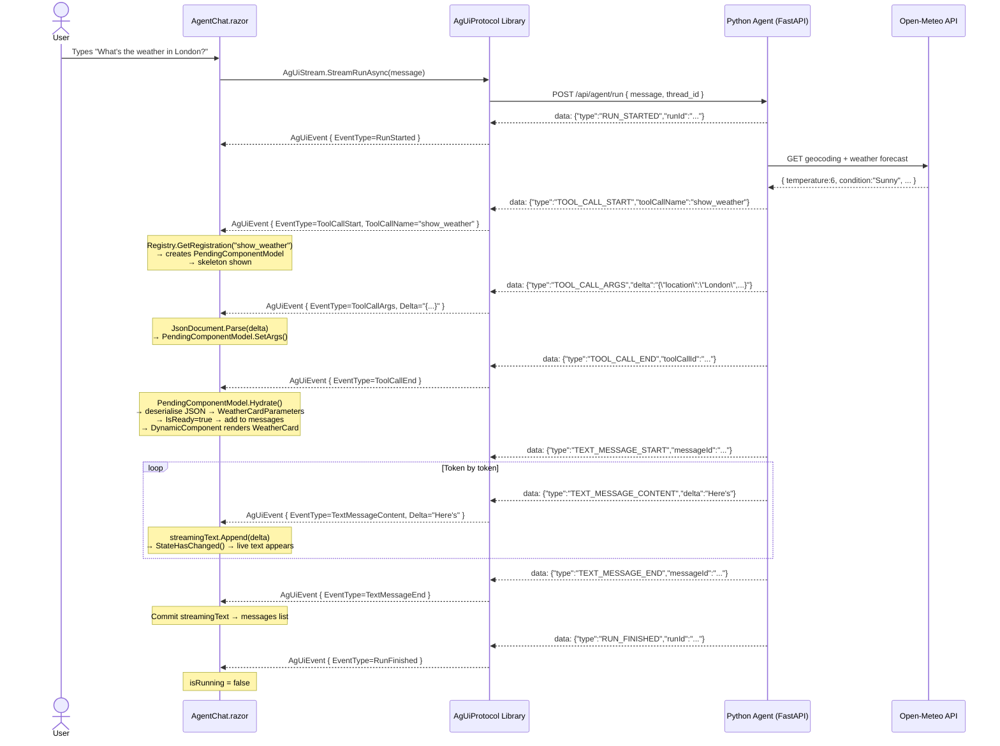

# AgUiProtocol — C# Library

A reusable .NET class library that implements the **AG-UI protocol** for Blazor Server applications.
It handles everything between the SSE wire and your Razor components: event parsing, component
binding, skeleton lifecycle, and startup validation. Your Blazor app only needs to register its
widgets and wire up one Razor component.

---

## Table of Contents

- [AgUiProtocol — C# Library](#aguiprotocol--c-library)
  - [Table of Contents](#table-of-contents)
  - [1. What Is the AG-UI Protocol?](#1-what-is-the-ag-ui-protocol)
  - [2. Library Architecture](#2-library-architecture)
  - [3. AG-UI Concepts and How the Library Implements Them](#3-ag-ui-concepts-and-how-the-library-implements-them)
    - [3.1 Event Stream — `AgUiStreamService`](#31-event-stream--aguistreamservice)
    - [3.2 Event Model — `AgUiEvent` + `AgUiEventType`](#32-event-model--aguievent--aguieventtype)
    - [3.3 Component Registry — `ComponentRegistry` + `ComponentRegistration`](#33-component-registry--componentregistry--componentregistration)
    - [3.4 Component Hydration — `PendingComponentModel`](#34-component-hydration--pendingcomponentmodel)
    - [3.5 Startup Validation — `AgentSchemaValidator`](#35-startup-validation--agentschemavalidator)
  - [4. Full Event Flow — Sequence Diagram](#4-full-event-flow--sequence-diagram)
  - [5. Integrating the Library with a New Blazor App](#5-integrating-the-library-with-a-new-blazor-app)
    - [Prerequisites](#prerequisites)
    - [Step 1 — Add the Project Reference](#step-1--add-the-project-reference)
    - [Step 2 — Add Global Using in `_Imports.razor`](#step-2--add-global-using-in-_importsrazor)
    - [Step 3 — Register Services in `Program.cs`](#step-3--register-services-in-programcs)
    - [Step 4 — Define Tool Name Constants](#step-4--define-tool-name-constants)
    - [Step 5 — Create a Widget Component](#step-5--create-a-widget-component)
    - [Step 6 — Create the UI Model](#step-6--create-the-ui-model)
    - [Step 7 — Build the Chat Razor Component](#step-7--build-the-chat-razor-component)
  - [6. JSON Field Name Contract](#6-json-field-name-contract)
  - [7. Quick Reference](#7-quick-reference)
    - [Library files](#library-files)
    - [Your app files](#your-app-files)
    - [Checklist for adding a new tool](#checklist-for-adding-a-new-tool)

---

## 1. What Is the AG-UI Protocol?

AG-UI (**Agent–User Interface**) is an open protocol that lets an AI agent communicate with a
frontend over **Server-Sent Events (SSE)**. The agent sends a stream of typed JSON events; the
frontend reacts to each one in real time.

```
User types a message
        │
        ▼
  Blazor App ──POST /api/agent/run──► Python Agent (LangGraph + LLM)
        │                                      │
        │◄──── text/event-stream ───────────────┘
        │
   Each SSE line:  data: { "type": "TEXT_MESSAGE_CONTENT", "delta": "Hello" }
```

The protocol defines **10 event types** organised into three groups:

| Group | Events | Purpose |
|-------|--------|---------|
| Run lifecycle | `RUN_STARTED`, `RUN_FINISHED`, `RUN_ERROR` | Marks the start and end of one agent run |
| Text streaming | `TEXT_MESSAGE_START`, `TEXT_MESSAGE_CONTENT`, `TEXT_MESSAGE_END` | Streams the agent's text response token by token |
| Tool calls (UI) | `TOOL_CALL_START`, `TOOL_CALL_ARGS`, `TOOL_CALL_END` | Delivers a rendered UI component with its data |

The key idea: when the agent wants to display a **rich UI widget** (weather card, flight list,
chart…) it emits a tool call instead of plain text. The frontend maps the tool name to a Blazor
component, hydrates it with the tool's JSON args, and renders it inline in the conversation.

---

## 2. Library Architecture

The library enforces a clean **Separation of Concerns**:

```
AgUiProtocol.dll  (this library)
├── AgUiEvent.cs              ← Wire format: enum + raw SSE envelope
├── AgUiStreamService.cs      ← Transport: HTTP POST → IAsyncEnumerable<AgUiEvent>
├── ComponentRegistration.cs  ← Descriptor: tool name → component type binding
├── ComponentRegistry.cs      ← Singleton map of all registered tools
├── PendingComponentModel.cs  ← Lifecycle: skeleton → hydration → DynamicComponent
└── AgentSchemaValidator.cs   ← Startup guard: registry vs agent schema

YourBlazorApp.dll  (your project)
├── Services/ToolNames.cs         ← App-specific tool name constants
├── Services/ChatMessageModel.cs  ← UI-layer message model
├── Components/Widgets/           ← Your Razor widget components
└── Components/GenUI/AgentChat.razor  ← Chat UI that consumes the library
```

The library has **zero knowledge** of your specific widgets or tool names. It only knows about the
protocol itself.

---

## 3. AG-UI Concepts and How the Library Implements Them

### 3.1 Event Stream — `AgUiStreamService`

**AG-UI concept:** The agent backend exposes a single HTTP endpoint that accepts a POST with the
user's message and responds with an SSE stream. Each line of the stream has the format:

```
data: {"type":"TEXT_MESSAGE_CONTENT","messageId":"abc","delta":"Hello"}\n\n
```

**Library implementation:**

```csharp
// AgUiStreamService.cs
public class AgUiStreamService
{
    private readonly HttpClient _http;

    public AgUiStreamService(HttpClient http) => _http = http;

    public async IAsyncEnumerable<AgUiEvent> StreamRunAsync(
        string userMessage,
        string? threadId = null,
        [EnumeratorCancellation] CancellationToken ct = default)
    {
        using var request = new HttpRequestMessage(HttpMethod.Post, "/api/agent/run")
        {
            Content = JsonContent.Create(new
            {
                message   = userMessage,
                thread_id = threadId ?? string.Empty,
            }),
        };

        using var response = await _http.SendAsync(
            request,
            HttpCompletionOption.ResponseHeadersRead,  // stream headers immediately
            ct);

        response.EnsureSuccessStatusCode();

        await using var stream = await response.Content.ReadAsStreamAsync(ct);
        using var reader = new StreamReader(stream);

        while (!reader.EndOfStream && !ct.IsCancellationRequested)
        {
            var line = await reader.ReadLineAsync(ct);

            if (line is null || !line.StartsWith("data: ", StringComparison.Ordinal))
                continue;

            var json = line[6..]; // strip "data: " prefix

            AgUiEvent? evt;
            try { evt = JsonSerializer.Deserialize<AgUiEvent>(json, _jsonOptions); }
            catch (JsonException) { continue; }

            if (evt is not null)
                yield return evt;
        }
    }
}
```

Three design decisions worth noting:

| Decision | Why |
|----------|-----|
| `HttpCompletionOption.ResponseHeadersRead` | Starts reading the body before it finishes downloading — essential for streaming |
| `IAsyncEnumerable<AgUiEvent>` return type | Caller uses `await foreach` and processes each event as it arrives |
| Skip malformed lines silently | SSE also sends comment lines (`:`), blank lines, and heartbeats; these must not crash the stream |

---

### 3.2 Event Model — `AgUiEvent` + `AgUiEventType`

**AG-UI concept:** Every event on the wire is a JSON object with a `type` discriminator field.
Depending on the type, other fields are present:

| Event type | Additional fields |
|------------|-------------------|
| `RUN_STARTED` | `runId`, `threadId` |
| `TEXT_MESSAGE_START` | `messageId` |
| `TEXT_MESSAGE_CONTENT` | `messageId`, `delta` (text token) |
| `TEXT_MESSAGE_END` | `messageId` |
| `TOOL_CALL_START` | `toolCallId`, `toolCallName` |
| `TOOL_CALL_ARGS` | `toolCallId`, `delta` (**JSON string** of tool output) |
| `TOOL_CALL_END` | `toolCallId` |
| `RUN_ERROR` | `error` |
| `RUN_FINISHED` | `runId` |

> **Important:** The Python ag-ui-protocol SDK serialises all multi-word field names in
> **camelCase** JSON (`toolCallName`, not `tool_call_name`). The C# `[JsonPropertyName]`
> attributes must reflect this exactly.

**Library implementation:**

```csharp
// AgUiEvent.cs
public enum AgUiEventType
{
    Unknown,
    RunStarted, TextMessageStart, TextMessageContent, TextMessageEnd,
    ToolCallStart, ToolCallArgs, ToolCallEnd,
    StateDelta, RunFinished, RunError,
}

public class AgUiEvent
{
    [JsonPropertyName("type")]       public string  Type        { get; set; } = string.Empty;
    [JsonPropertyName("runId")]      public string? RunId       { get; set; }
    [JsonPropertyName("messageId")]  public string? MessageId   { get; set; }
    [JsonPropertyName("delta")]      public string? Delta       { get; set; }
    [JsonPropertyName("toolCallId")] public string? ToolCallId  { get; set; }
    [JsonPropertyName("toolCallName")] public string? ToolCallName { get; set; }
    [JsonPropertyName("error")]      public string? Error       { get; set; }

    // Converts the raw string discriminator to the strongly-typed enum
    public AgUiEventType EventType => Type switch
    {
        "RUN_STARTED"          => AgUiEventType.RunStarted,
        "TEXT_MESSAGE_CONTENT" => AgUiEventType.TextMessageContent,
        "TEXT_MESSAGE_END"     => AgUiEventType.TextMessageEnd,
        "TOOL_CALL_START"      => AgUiEventType.ToolCallStart,
        "TOOL_CALL_ARGS"       => AgUiEventType.ToolCallArgs,
        "TOOL_CALL_END"        => AgUiEventType.ToolCallEnd,
        "RUN_FINISHED"         => AgUiEventType.RunFinished,
        "RUN_ERROR"            => AgUiEventType.RunError,
        _                      => AgUiEventType.Unknown,
    };
}
```

The `Delta` field is **dual-purpose**:
- For `TEXT_MESSAGE_CONTENT` → a plain text token to append to the streaming buffer
- For `TOOL_CALL_ARGS` → a **complete JSON string** of the tool's output (call `JsonDocument.Parse` on it)

---

### 3.3 Component Registry — `ComponentRegistry` + `ComponentRegistration`

**AG-UI concept:** The frontend must know which Blazor component to render for each tool name the
agent can emit. This mapping is owned by the developer, not the library.

**Library implementation:**

`ComponentRegistration` is an immutable record that holds everything the library needs to hydrate
a component:

```csharp
// ComponentRegistration.cs
public record ComponentRegistration
{
    public required Type   ComponentType   { get; init; }  // typeof(WeatherCard)
    public required Type   ParametersType  { get; init; }  // typeof(WeatherCardParameters)
    public required string ToolName        { get; init; }  // "show_weather"
    public required string Description     { get; init; }
    public required string SuggestedPrompt { get; init; }
    public          int    ExpectedHeight  { get; init; } = 200; // pixels for skeleton
}
```

`ComponentRegistry` is a dictionary wrapper registered as a DI singleton:

```csharp
// ComponentRegistry.cs
public class ComponentRegistry
{
    private readonly Dictionary<string, ComponentRegistration> _map = new();

    public void Register<TComponent, TParams>(
        string toolName,
        string description,
        string suggestedPrompt,
        int    expectedHeight = 200)
        where TComponent : ComponentBase
        where TParams    : class, new()
    {
        _map[toolName] = new ComponentRegistration
        {
            ComponentType   = typeof(TComponent),
            ParametersType  = typeof(TParams),
            ToolName        = toolName,
            Description     = description,
            SuggestedPrompt = suggestedPrompt,
            ExpectedHeight  = expectedHeight,
        };
    }

    public ComponentRegistration? GetRegistration(string toolName) =>
        _map.TryGetValue(toolName, out var reg) ? reg : null;

    public IEnumerable<ComponentRegistration> GetAll() => _map.Values;
}
```

The generic constraints `where TComponent : ComponentBase` and `where TParams : class, new()`
ensure at compile time that only valid Blazor components and instantiable parameter classes can
be registered.

---

### 3.4 Component Hydration — `PendingComponentModel`

**AG-UI concept:** A UI component arrives in three stages:

```
TOOL_CALL_START  →  component identity known,  data not yet arrived
TOOL_CALL_ARGS   →  data arrives as a JSON string
TOOL_CALL_END    →  data is complete, deserialise and render
```

During this window, the UI should show a **skeleton placeholder** to prevent Cumulative Layout
Shift (CLS) — a jarring jump when the component suddenly appears.

**Library implementation:**

```csharp
// PendingComponentModel.cs
public class PendingComponentModel
{
    // Python sends snake_case keys; C# params classes use PascalCase properties.
    private static readonly JsonSerializerOptions _jsonOptions = new()
    {
        PropertyNameCaseInsensitive = true,
        PropertyNamingPolicy        = JsonNamingPolicy.SnakeCaseLower,
        NumberHandling              = JsonNumberHandling.AllowReadingFromString,
    };

    public required ComponentRegistration Registration { get; init; }
    public bool IsReady        { get; private set; }
    public int  ExpectedHeight => Registration.ExpectedHeight;
    public Type ComponentType  => Registration.ComponentType;

    private JsonElement? _args;

    // Called when TOOL_CALL_ARGS arrives
    public void SetArgs(JsonElement? args) => _args = args;

    // Called when TOOL_CALL_END arrives
    public void Hydrate()
    {
        if (_args is null) return;

        var raw       = _args.Value.GetRawText();
        var paramsObj = JsonSerializer.Deserialize(raw, Registration.ParametersType, _jsonOptions);
        if (paramsObj is null) return;

        Parameters = new Dictionary<string, object?> { ["Params"] = paramsObj };
        IsReady    = true;
    }

    // Passed directly to <DynamicComponent Parameters="..."> after hydration
    public IDictionary<string, object?>? Parameters { get; private set; }
}
```

State machine:

```
Created (IsReady=false)
    │
    │  SetArgs(jsonElement)
    │
    ▼
Args stored (IsReady=false) ← skeleton still showing
    │
    │  Hydrate()
    │   ├─ Deserialise JSON → TParams instance
    │   └─ Build Parameters dict {"Params": instance}
    ▼
IsReady=true → add to messages → DynamicComponent renders
```

The `JsonNamingPolicy.SnakeCaseLower` policy automatically maps `wind_speed` (Python) to
`WindSpeed` (C# property), so you never need `[JsonPropertyName]` on your parameter classes.

---

### 3.5 Startup Validation — `AgentSchemaValidator`

**AG-UI concept:** Tool names are strings that must match between the Python agent and the C#
frontend. A typo or drift between the two is silent at compile time but breaks at runtime.

**Library implementation:**

```csharp
// AgentSchemaValidator.cs
public static class AgentSchemaValidator
{
    public static async Task ValidateAsync(
        ComponentRegistry registry,
        HttpClient        http,
        ILogger           logger,
        CancellationToken ct = default)
    {
        // 1. Fetch the agent's published tool list
        var response  = await http.GetAsync("/api/agent/schema", ct);
        var body      = await response.Content.ReadAsStringAsync(ct);
        var agentTools = JsonDocument.Parse(body)
                            .RootElement.GetProperty("ui_tools")
                            .EnumerateArray()
                            .Select(e => e.GetString() ?? "")
                            .ToHashSet();

        // 2. Find any tool registered in C# that the agent doesn't know about
        var mismatches = registry.GetAll()
                            .Select(r => r.ToolName)
                            .Where(name => !agentTools.Contains(name))
                            .ToList();

        // 3. Fail-fast: refuse to start if there is a mismatch
        if (mismatches.Count > 0)
            throw new InvalidOperationException(
                $"AG-UI tool name mismatch for: {string.Join(", ", mismatches)}");
    }
}
```

If the agent is not running when the Blazor app starts (common in development), the HTTP call
throws a `HttpRequestException` which is caught and logged as a warning — validation is skipped
so the developer is not blocked.

---

## 4. Full Event Flow — Sequence Diagram



---

## 5. Integrating the Library with a New Blazor App

This section walks through adding `AgUiProtocol` to a **brand new** Blazor Server app from
scratch.

### Prerequisites

- .NET 8 SDK
- A running AG-UI Python agent at `http://localhost:8000`
- The `AgUiProtocol` project available locally

---

### Step 1 — Add the Project Reference

Create a new Blazor Server app and add a reference to the library:

```bash
dotnet new blazor -o MyAgentApp --interactivity Server
cd MyAgentApp
```

Edit `MyAgentApp.csproj`:

```xml
<Project Sdk="Microsoft.NET.Sdk.Web">

  <PropertyGroup>
    <TargetFramework>net8.0</TargetFramework>
    <Nullable>enable</Nullable>
    <ImplicitUsings>enable</ImplicitUsings>
  </PropertyGroup>

  <ItemGroup>
    <!-- Point this at wherever AgUiProtocol lives on your machine -->
    <ProjectReference Include="..\AgUiProtocol\AgUiProtocol.csproj" />
  </ItemGroup>

</Project>
```

---

### Step 2 — Add Global Using in `_Imports.razor`

Open `Components/_Imports.razor` and add the library namespace so every Razor file can resolve
its types without per-file `@using` directives:

```razor
@using System.Net.Http
@using System.Net.Http.Json
@using Microsoft.AspNetCore.Components.Forms
@using Microsoft.AspNetCore.Components.Routing
@using Microsoft.AspNetCore.Components.Web
@using static Microsoft.AspNetCore.Components.Web.RenderMode
@using Microsoft.AspNetCore.Components.Web.Virtualization
@using Microsoft.JSInterop
@using MyAgentApp
@using MyAgentApp.Components
@using AgUiProtocol                    ← add this
@using MyAgentApp.Services             ← add this (for your app-specific types)
```

---

### Step 3 — Register Services in `Program.cs`

```csharp
using AgUiProtocol;
using MyAgentApp.Components;
using MyAgentApp.Components.Widgets;
using MyAgentApp.Services;

var builder = WebApplication.CreateBuilder(args);

builder.Services.AddRazorComponents()
    .AddInteractiveServerComponents();

// 1. Register the AG-UI HTTP client pointing at your agent
builder.Services.AddHttpClient<AgUiStreamService>(client =>
{
    var agentUrl = builder.Configuration["AgentUrl"] ?? "http://localhost:8000";
    client.BaseAddress = new Uri(agentUrl);
    client.Timeout = TimeSpan.FromMinutes(5);
});

// 2. Build the registry — one Register<> call per agent tool
builder.Services.AddSingleton<ComponentRegistry>(sp =>
{
    var registry = new ComponentRegistry();

    registry.Register<StockCard, StockCardParameters>(
        toolName:        ToolNames.ShowStock,
        description:     "Display a live stock price card.",
        suggestedPrompt: "What is the MSFT stock price?",
        expectedHeight:  180);

    // Add more tools here as your agent grows
    return registry;
});

var app = builder.Build();

// 3. Startup validation — refuses to start if tool names are out of sync
using (var scope = app.Services.CreateScope())
{
    var registry    = scope.ServiceProvider.GetRequiredService<ComponentRegistry>();
    var httpFactory = scope.ServiceProvider.GetRequiredService<IHttpClientFactory>();
    var http        = httpFactory.CreateClient(nameof(AgUiStreamService));
    var logger      = scope.ServiceProvider
                           .GetRequiredService<ILoggerFactory>()
                           .CreateLogger(nameof(AgentSchemaValidator));

    await AgentSchemaValidator.ValidateAsync(registry, http, logger);
}

app.UseHttpsRedirection();
app.UseStaticFiles();
app.UseAntiforgery();
app.MapRazorComponents<App>().AddInteractiveServerRenderMode();
app.Run();
```

---

### Step 4 — Define Tool Name Constants

Create `Services/ToolNames.cs` — the single source of truth for tool name strings in your app.
The string values must match exactly what the Python agent registers.

```csharp
// Services/ToolNames.cs
namespace MyAgentApp.Services;

public static class ToolNames
{
    public const string ShowStock = "show_stock";
    // Add one constant per tool your agent exposes
}
```

On the Python side, mirror this:

```python
# tool_names.py
class ToolNames:
    SHOW_STOCK = "show_stock"

    @classmethod
    def all_ui_tools(cls) -> frozenset[str]:
        return frozenset({cls.SHOW_STOCK})
```

---

### Step 5 — Create a Widget Component

Each tool maps to one Blazor component. The component must follow one convention: a single
`[Parameter]` property named **`Params`** of a strongly-typed class.

**Parameter class** (`Services/StockCardParameters.cs`):

```csharp
// Services/StockCardParameters.cs
namespace MyAgentApp.Services;

public class StockCardParameters
{
    // Property names are PascalCase; the library maps from snake_case JSON automatically.
    public string Symbol      { get; set; } = string.Empty;
    public string CompanyName { get; set; } = string.Empty;
    public double Price       { get; set; }
    public double Change      { get; set; }
    public string Currency    { get; set; } = "USD";
}
```

**Widget component** (`Components/Widgets/StockCard.razor`):

```razor
@namespace MyAgentApp.Components.Widgets

<div class="stock-card">
    <div class="stock-card__header">
        <span class="stock-card__symbol">@Params.Symbol</span>
        <span class="stock-card__name">@Params.CompanyName</span>
    </div>
    <div class="stock-card__price">
        @Params.Currency @Params.Price.ToString("N2")
    </div>
    <div class="stock-card__change @(Params.Change >= 0 ? "positive" : "negative")">
        @(Params.Change >= 0 ? "▲" : "▼") @Math.Abs(Params.Change).ToString("N2")%
    </div>
</div>

@code {
    [Parameter] public StockCardParameters Params { get; set; } = new();
}
```

> **Convention:** The `[Parameter]` property must be named exactly `Params`. The library
> uses the string key `"Params"` when building the dictionary passed to `DynamicComponent`.

---

### Step 6 — Create the UI Model

This is a **UI-layer class** that lives in your app, not in the library. It holds one entry in
the chat history (either text or a hydrated component).

```csharp
// Services/ChatMessageModel.cs
using AgUiProtocol;

namespace MyAgentApp.Services;

public class ChatMessageModel
{
    public string?               Content   { get; init; }
    public bool                  IsUser    { get; init; }
    public bool                  IsError   { get; init; }
    public bool                  IsStreaming { get; init; }
    public PendingComponentModel? Component { get; init; }

    public bool IsComponent => Component is not null;

    public static ChatMessageModel Text(string content, bool isUser = false, bool isError = false) =>
        new() { Content = content, IsUser = isUser, IsError = isError };

    public static ChatMessageModel FromComponent(PendingComponentModel component) =>
        new() { Component = component };
}
```

---

### Step 7 — Build the Chat Razor Component

This is the main chat UI. It consumes the library's services and renders the conversation.

```razor
@* Components/Chat/AgentChat.razor *@
@namespace MyAgentApp.Components.Chat
@using MyAgentApp.Components.Widgets
@using MyAgentApp.Services
@inject AgUiStreamService AgUiStream
@inject ComponentRegistry Registry
@implements IDisposable

<div class="agent-chat">

    @* Suggestion chips from the registry *@
    @if (messages.Count == 0 && !isRunning)
    {
        <div class="suggestions">
            @foreach (var reg in Registry.GetAll())
            {
                <button @onclick="() => inputText = reg.SuggestedPrompt">
                    @reg.SuggestedPrompt
                </button>
            }
        </div>
    }

    @* Message history *@
    <div class="messages" @ref="scrollAnchorParent">
        @foreach (var msg in messages)
        {
            @if (msg.IsComponent && msg.Component is not null)
            {
                <div class="component-slot">
                    <ErrorBoundary>
                        <ChildContent>
                            <DynamicComponent Type="@msg.Component.ComponentType"
                                              Parameters="@msg.Component.Parameters" />
                        </ChildContent>
                        <ErrorContent Context="ex">
                            <p class="error">⚠ @ex.Message</p>
                        </ErrorContent>
                    </ErrorBoundary>
                </div>
            }
            else
            {
                <div class="bubble @(msg.IsUser ? "user" : "agent")">
                    @msg.Content
                </div>
            }
        }

        @* Live streaming text *@
        @if (streamingText.Length > 0)
        {
            <div class="bubble agent streaming">@streamingText.ToString()</div>
        }

        @* Skeleton placeholder while component data streams in *@
        @if (currentComponent is not null && !currentComponent.IsReady)
        {
            <div class="skeleton" style="min-height: @(currentComponent.ExpectedHeight)px">
                <div class="skeleton-bar wide"></div>
                <div class="skeleton-bar medium"></div>
                <div class="skeleton-bar narrow"></div>
            </div>
        }

        <div @ref="scrollBottom"></div>
    </div>

    @* Input bar *@
    <div class="input-bar">
        @if (lastError is not null)
        {
            <p class="error">⚠ @lastError</p>
        }
        <input @bind="inputText"
               @bind:event="oninput"
               @onkeydown="OnKeyDown"
               placeholder="Ask me anything..."
               disabled="@isRunning" />
        <button @onclick="Submit" disabled="@isRunning">Send</button>
    </div>
</div>

@code {
    // ── State ──────────────────────────────────────────────────────────────
    private readonly List<ChatMessageModel>   messages      = new();
    private readonly System.Text.StringBuilder streamingText = new();
    private PendingComponentModel?             currentComponent;
    private bool                               isRunning;
    private string?                            lastError;
    private string                             inputText = string.Empty;
    private CancellationTokenSource?           _cts;
    private ElementReference                   scrollBottom;

    [Inject] private IJSRuntime JS { get; set; } = default!;

    // ── Submit ─────────────────────────────────────────────────────────────
    private async Task Submit()
    {
        var message = inputText.Trim();
        if (string.IsNullOrEmpty(message) || isRunning) return;

        inputText = string.Empty;
        lastError = null;
        messages.Add(ChatMessageModel.Text(message, isUser: true));
        isRunning = true;
        streamingText.Clear();
        currentComponent = null;
        _cts = new CancellationTokenSource();

        StateHasChanged();

        try
        {
            await foreach (var evt in AgUiStream.StreamRunAsync(message, ct: _cts.Token))
            {
                HandleEvent(evt);
                StateHasChanged();
                await JS.InvokeVoidAsync("scrollToElement", scrollBottom);
            }
        }
        catch (OperationCanceledException) { }
        catch (Exception ex)
        {
            lastError = $"Agent error: {ex.Message}";
        }
        finally
        {
            isRunning = false;
            if (streamingText.Length > 0)
            {
                messages.Add(ChatMessageModel.Text(streamingText.ToString()));
                streamingText.Clear();
            }
            currentComponent = null;
            StateHasChanged();
        }
    }

    private Task OnKeyDown(KeyboardEventArgs e) =>
        e.Key == "Enter" && !e.ShiftKey ? Submit() : Task.CompletedTask;

    // ── AG-UI Event Dispatcher ─────────────────────────────────────────────
    private void HandleEvent(AgUiEvent evt)
    {
        switch (evt.EventType)
        {
            case AgUiEventType.RunStarted:
                isRunning = true;
                break;

            case AgUiEventType.TextMessageContent:
                if (evt.Delta is not null)
                    streamingText.Append(evt.Delta);
                break;

            case AgUiEventType.TextMessageEnd:
                if (streamingText.Length > 0)
                {
                    messages.Add(ChatMessageModel.Text(streamingText.ToString()));
                    streamingText.Clear();
                }
                break;

            case AgUiEventType.ToolCallStart:
                // Commit any in-progress text before the component slot opens
                if (streamingText.Length > 0)
                {
                    messages.Add(ChatMessageModel.Text(streamingText.ToString()));
                    streamingText.Clear();
                }
                var toolName = evt.ToolCallName ?? string.Empty;
                var reg = Registry.GetRegistration(toolName);
                if (reg is not null)
                    currentComponent = new PendingComponentModel { Registration = reg };
                else
                    JS.InvokeVoidAsync("console.warn",
                        $"[AG-UI] Unknown tool '{toolName}' — not in ComponentRegistry.");
                break;

            case AgUiEventType.ToolCallArgs:
                // Delta is a complete JSON string — parse and store
                if (evt.Delta is not null && currentComponent is not null)
                {
                    using var doc = System.Text.Json.JsonDocument.Parse(evt.Delta);
                    currentComponent.SetArgs(doc.RootElement.Clone());
                }
                break;

            case AgUiEventType.ToolCallEnd:
                if (currentComponent is not null)
                {
                    currentComponent.Hydrate();
                    if (currentComponent.IsReady)
                        messages.Add(ChatMessageModel.FromComponent(currentComponent));
                    currentComponent = null;
                }
                break;

            case AgUiEventType.RunFinished:
                isRunning = false;
                break;

            case AgUiEventType.RunError:
                isRunning = false;
                lastError = evt.Error;
                if (evt.Error is not null)
                    messages.Add(ChatMessageModel.Text(evt.Error, isError: true));
                break;
        }
    }

    public void Dispose() => _cts?.Cancel();
}
```

---

## 6. JSON Field Name Contract

The Python ag-ui-protocol SDK and the C# library must agree on JSON field names.

| Python field | JSON on the wire | C# property | `[JsonPropertyName]` |
|---|---|---|---|
| `type` | `type` | `Type` | `"type"` |
| `run_id` | `runId` | `RunId` | `"runId"` |
| `message_id` | `messageId` | `MessageId` | `"messageId"` |
| `tool_call_id` | `toolCallId` | `ToolCallId` | `"toolCallId"` |
| `tool_call_name` | `toolCallName` | `ToolCallName` | `"toolCallName"` |
| `delta` | `delta` | `Delta` | `"delta"` |
| `error` | `error` | `Error` | `"error"` |

> **Why camelCase?** The Python SDK uses Pydantic with a camelCase alias generator for JSON
> output (common for protocols targeting JavaScript clients). Single-word fields like `delta`,
> `type`, and `error` are unaffected. Multi-word fields become camelCase: `tool_call_name` →
> `toolCallName`.

For tool output data (inside `TOOL_CALL_ARGS.delta`), the direction reverses:

| Python dict key | C# property | Why it works |
|---|---|---|
| `wind_speed` | `WindSpeed` | `JsonNamingPolicy.SnakeCaseLower` in `PendingComponentModel` |
| `company_name` | `CompanyName` | Same policy |
| `price_gbp` | `PriceGbp` | Same policy |

Your C# parameter classes need **no `[JsonPropertyName]` attributes** — the naming policy handles
the mapping automatically.

---

## 7. Quick Reference

### Library files

| File | Responsibility |
|------|---------------|
| `AgUiEvent.cs` | Wire format — enum + raw SSE envelope |
| `AgUiStreamService.cs` | Transport — HTTP POST → `IAsyncEnumerable<AgUiEvent>` |
| `ComponentRegistration.cs` | Descriptor — tool name → component type + metadata |
| `ComponentRegistry.cs` | Map — singleton dictionary of all registered tools |
| `PendingComponentModel.cs` | Lifecycle — skeleton → hydration → `DynamicComponent` |
| `AgentSchemaValidator.cs` | Guard — startup check, throws on tool name mismatch |

### Your app files

| File | Responsibility |
|------|---------------|
| `Services/ToolNames.cs` | Constants — tool name strings (must match Python) |
| `Services/ChatMessageModel.cs` | UI model — one entry in the conversation list |
| `Components/Widgets/*.razor` | Your widget components (one per agent tool) |
| `Components/Chat/AgentChat.razor` | Chat UI — consumes the library |
| `Program.cs` | DI setup — register services + startup validation |
| `Components/_Imports.razor` | Global `@using AgUiProtocol` |

### Checklist for adding a new tool

- [ ] Add constant to `ToolNames.cs` (C#) and `tool_names.py` (Python)
- [ ] Create `TParams` class with PascalCase properties matching the tool's snake_case JSON output
- [ ] Create Blazor widget with `[Parameter] public TParams Params { get; set; } = new();`
- [ ] Call `registry.Register<TWidget, TParams>(toolName, ...)` in `Program.cs`
- [ ] On the Python side: decorate the tool function with `@tool(ToolNames.SHOW_XYZ)` and include it in `all_ui_tools()`
