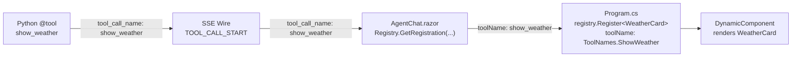
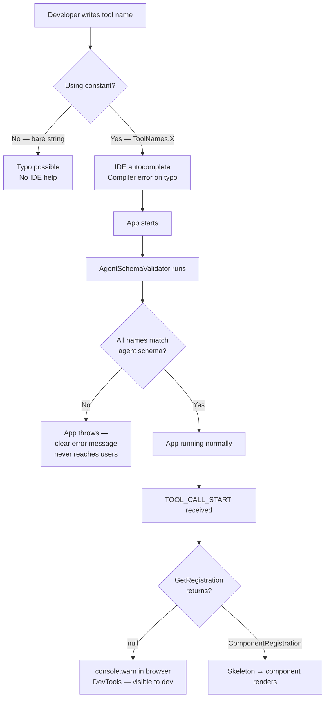
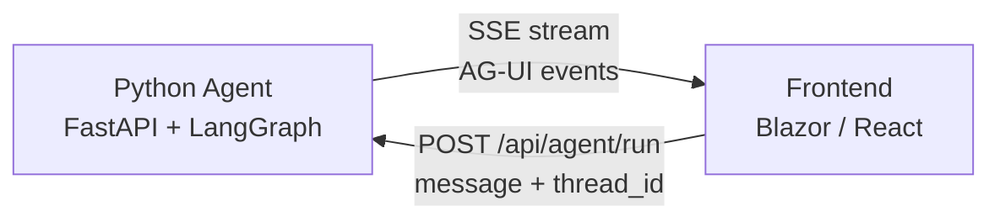
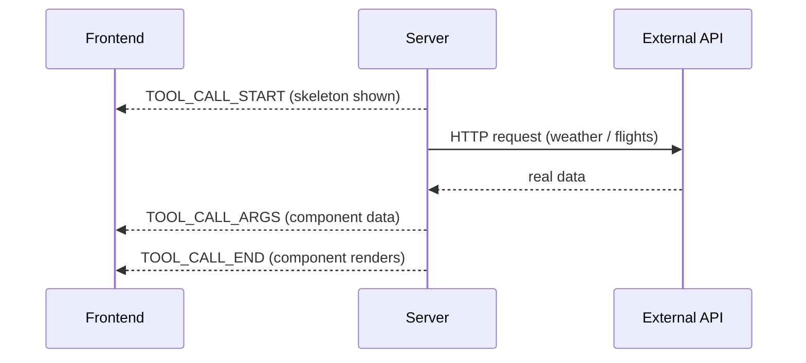
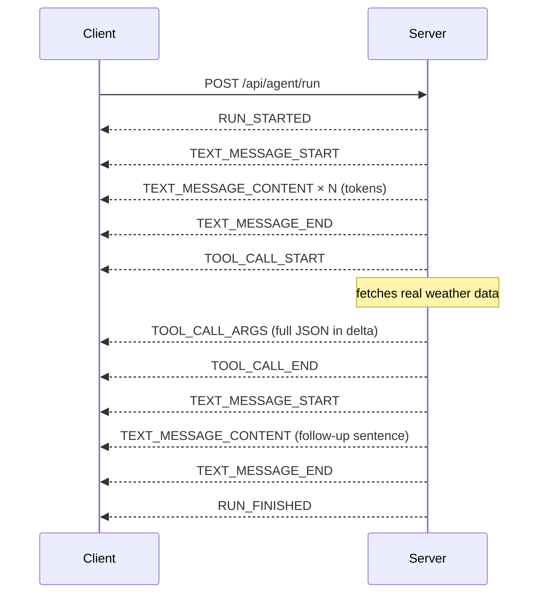
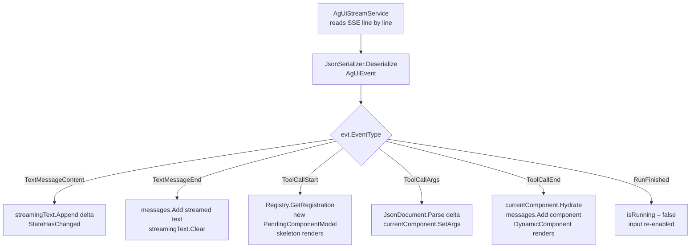
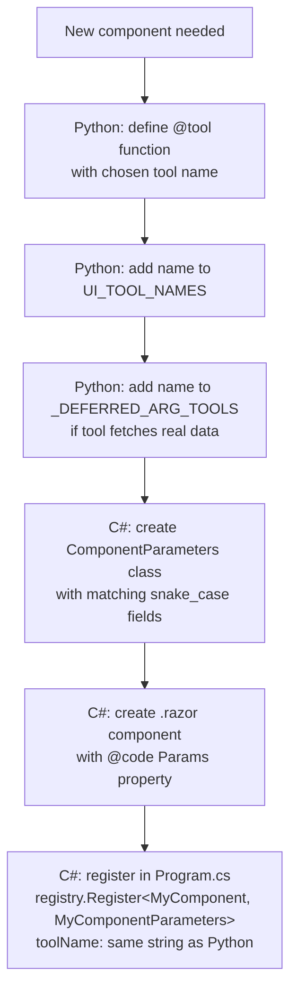
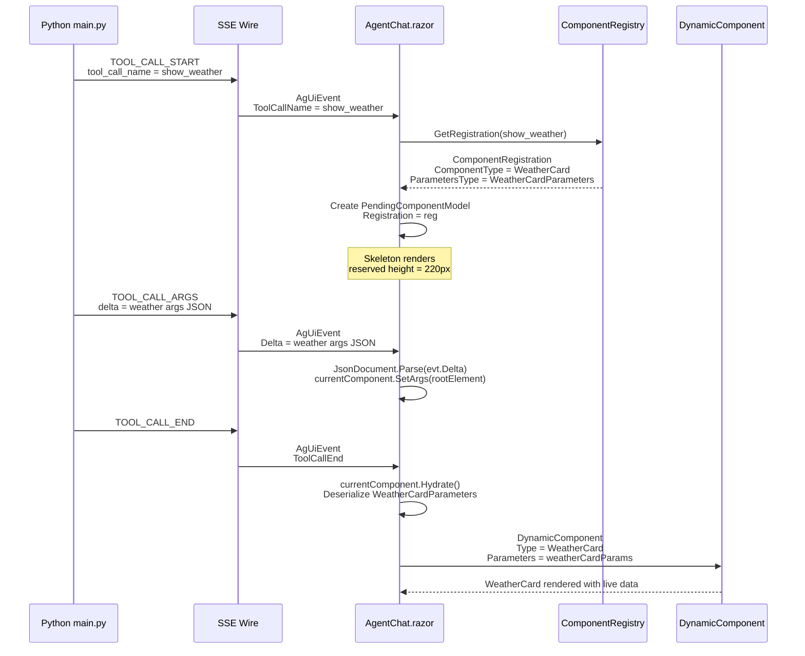

# Using `ag-ui-protocol` in Python — Server and Client

---

## The Tool Name Contract — Problem and Best Practices

### The Problem

The **tool name string** is the single piece of glue connecting the Python agent to the Blazor frontend. It travels across a language boundary with no compiler enforcement.



**Four places — one string:**

| # | Location | File | Code |
|---|---|---|---|
| 1 | Tool function name | `main.py` | `@tool def show_weather(...)` |
| 2 | UI tool set | `main.py` | `UI_TOOL_NAMES = ToolNames.all_ui_tools()` |
| 3 | Component registration | `Program.cs` | `registry.Register<WeatherCard, ...>(toolName: ToolNames.ShowWeather)` |
| 4 | Lookup at runtime | `AgentChat.razor` | `Registry.GetRegistration(evt.ToolCallName)` |

Two failure modes exist without safeguards:

- **Typo at authoring time** — `"show_wheather"` vs `"show_weather"` in one file
- **Drift over time** — tool renamed in Python, C# registration forgotten

Both fail **silently** at runtime — no exception, no log, the component simply never appears.

---

### Industry Best Practices

| Level | Practice | Protection |
|---|---|---|
| 1 | Named constants per language | Eliminates typos — IDE autocomplete, compiler errors |
| 2 | Agent introspection endpoint | Machine-readable contract between Python and C# |
| 3 | Fail-fast startup validation | App refuses to start if names don't match |
| 4 | Observable runtime failure | Browser console warning when lookup returns null |

Levels 1–4 are all implemented in this project.

---

### Level 1 — Named Constants (Single Source of Truth)

The string literal `"show_weather"` is defined **once per language**. Every other file imports the constant — no bare string literals anywhere else.

**Python — `tool_names.py`**

```python
class ToolNames:
    SHOW_WEATHER        = "show_weather"
    SHOW_FLIGHT_OPTIONS = "show_flight_options"

    @classmethod
    def all_ui_tools(cls) -> frozenset[str]:
        return frozenset({cls.SHOW_WEATHER, cls.SHOW_FLIGHT_OPTIONS})
```

Usage in `main.py`:

```python
from tool_names import ToolNames

# @tool function name must match the constant
@tool
def show_weather(location: str) -> str: ...         # name = ToolNames.SHOW_WEATHER

UI_TOOL_NAMES       = ToolNames.all_ui_tools()      # no bare strings
_DEFERRED_ARG_TOOLS = ToolNames.all_ui_tools()
```

**C# — `ToolNames.cs`**

```csharp
public static class ToolNames
{
    public const string ShowWeather       = "show_weather";
    public const string ShowFlightOptions = "show_flight_options";
}
```

Usage in `Program.cs`:

```csharp
registry.Register<WeatherCard, WeatherCardParameters>(
    toolName: ToolNames.ShowWeather, ...);          // no bare strings

registry.Register<FlightOptions, FlightOptionsParameters>(
    toolName: ToolNames.ShowFlightOptions, ...);
```

> **Why this matters:** If you rename a tool, your IDE finds every reference to `ToolNames.ShowWeather` instantly. A bare string `"show_weather"` scattered across files is invisible to refactoring tools.

---

### Level 2 — Agent Introspection Endpoint

The Python agent exposes `/api/agent/schema` which returns the list of registered UI tool names. This gives the C# app a machine-readable contract to validate against.

```python
# main.py
@app.get("/api/agent/schema")
async def schema() -> dict:
    return {"ui_tools": sorted(UI_TOOL_NAMES)}
```

Sample response:

```json
{
  "ui_tools": ["show_flight_options", "show_weather"]
}
```

---

### Level 3 — Fail-Fast Startup Validation

`AgentSchemaValidator.cs` runs during app startup. It fetches `/api/agent/schema`, compares the returned tool names against every name registered in `ComponentRegistry`, and **throws** if any mismatch is found.

```csharp
// AgentSchemaValidator.cs (called from Program.cs at startup)
public static async Task ValidateAsync(
    ComponentRegistry registry, HttpClient http, ILogger logger, ...)
{
    // Fetch the agent's known UI tools
    var agentTools = await FetchAgentToolNamesAsync(http);

    // Find any registered names that the agent does not know about
    var mismatches = registry.GetAll()
                             .Select(r => r.ToolName)
                             .Where(name => !agentTools.Contains(name))
                             .ToList();

    if (mismatches.Count > 0)
    {
        logger.LogError("Tool name mismatch: {Names}. Check ToolNames.cs and tool_names.py.",
                        string.Join(", ", mismatches));

        throw new InvalidOperationException(
            $"Tool name mismatch detected for: {string.Join(", ", mismatches)}");
    }
}
```

Wired into `Program.cs` after `app` is built:

```csharp
// Program.cs
using (var scope = app.Services.CreateScope())
{
    var registry = scope.ServiceProvider.GetRequiredService<ComponentRegistry>();
    var http     = scope.ServiceProvider
                        .GetRequiredService<IHttpClientFactory>()
                        .CreateClient(nameof(AgUiStreamService));
    var logger   = scope.ServiceProvider.GetRequiredService<ILogger<AgentSchemaValidator>>();

    await AgentSchemaValidator.ValidateAsync(registry, http, logger);
}
```

**What happens on mismatch:**

```
fail: AgentSchemaValidator[0]
      Tool name mismatch: 'show_wheather'. Check ToolNames.cs and tool_names.py.

Unhandled exception. System.InvalidOperationException:
  Tool name mismatch detected for: show_wheather.
```

The app exits immediately. No user ever reaches the page with a broken component.

> **Note:** `AgentSchemaValidator` logs a warning and continues (does not throw) when the agent is unreachable. This allows the Blazor app to start in isolation during frontend-only development when the Python agent is not running.

---

### Level 4 — Observable Runtime Failure

Even with startup validation, a runtime lookup failure is possible (e.g. if the Blazor app was already running when the agent was redeployed with renamed tools). The `AgentChat.razor` component writes a console warning so the failure is visible in browser DevTools instead of being completely silent.

```csharp
// AgentChat.razor
case AgUiEventType.ToolCallStart:
    var toolName = evt.ToolCallName ?? string.Empty;
    var reg = Registry.GetRegistration(toolName);
    if (reg is not null)
        currentComponent = new PendingComponentModel { Registration = reg };
    else
        JS.InvokeVoidAsync("console.warn",
            $"[AG-UI] No component registered for tool '{toolName}'. " +
            "Check ToolNames.cs and Program.cs are in sync with tool_names.py.");
    break;
```

Browser DevTools output:

```
[AG-UI] No component registered for tool 'show_wheather'.
Check ToolNames.cs and Program.cs are in sync with tool_names.py.
```

---

### Protection Summary



---

## What is AG-UI Protocol?

AG-UI (Agent-User Interaction) is an **open protocol standard** that defines how an AI agent communicates with a frontend over a streaming HTTP connection using **Server-Sent Events (SSE)**.

Think of it like this: HTTP defines how web pages load. AG-UI defines how agents send live UI events to a browser.

The `ag-ui-protocol` Python package gives you:

- Strongly typed Pydantic classes for every event type
- An `EventEncoder` that formats events into SSE-compatible strings automatically
- A standard vocabulary of event names that any AG-UI compatible frontend understands



---

## Installation

```bash
pip install ag-ui-protocol
```

The package exposes two modules:

| Module | What it contains |
|---|---|
| `ag_ui.core` | All event classes, the `EventType` enum, base models |
| `ag_ui.encoder` | `EventEncoder` — converts events to SSE strings |

---

## Part 1: Server Side (`main.py`)

The server is a **FastAPI** application. It receives a user message, runs a LangGraph agent, and streams AG-UI events back to the client using Server-Sent Events.

### Step 1 — Import and initialise

```python
from ag_ui.core import (
    EventType,
    RunStartedEvent,
    RunFinishedEvent,
    RunErrorEvent,
    TextMessageStartEvent,
    TextMessageContentEvent,
    TextMessageEndEvent,
    ToolCallStartEvent,
    ToolCallArgsEvent,
    ToolCallEndEvent,
)
from ag_ui.encoder import EventEncoder

_encoder = EventEncoder()   # one shared instance — stateless and thread-safe
```

You create **one `EventEncoder` instance** for the whole application. It is stateless, so it is safe to share across requests.

### Step 2 — Return a `StreamingResponse`

The FastAPI endpoint returns a `StreamingResponse` with `media_type="text/event-stream"`. The response body is an async generator that yields encoded SSE strings.

```python
from fastapi.responses import StreamingResponse
from pydantic import BaseModel

class RunRequest(BaseModel):
    message: str
    thread_id: str = ""

@app.post("/api/agent/run")
async def run_agent(body: RunRequest) -> StreamingResponse:
    return StreamingResponse(
        _ag_ui_stream(body.message, body.thread_id),
        media_type="text/event-stream",
        headers={
            "Cache-Control":    "no-cache",       # prevent proxy caching
            "X-Accel-Buffering": "no",            # disable nginx buffering
            "Connection":       "keep-alive",     # keep the socket open
        },
    )
```

The three headers are essential for SSE to work correctly through reverse proxies and browsers.

### Step 3 — Build the event stream generator

The generator function `_ag_ui_stream` is an `async def` function that uses `yield` to emit AG-UI events as they happen.

```python
async def _ag_ui_stream(message: str, thread_id: str) -> AsyncGenerator[str, None]:
    ...
```

Every `yield` statement emits one SSE line to the client, like this:

```
data: {"type":"TEXT_MESSAGE_CONTENT","messageId":"...","delta":"Hello"}\n\n
```

You never write this string manually. You call `_encoder.encode(event)` and it handles the formatting.

### Step 4 — Emit lifecycle events

Every run must open with `RunStartedEvent` and close with `RunFinishedEvent`. Both require a `run_id` (UUID) and a `thread_id` (for multi-turn conversation continuity).

```python
run_id = str(uuid.uuid4())
tid    = thread_id or run_id          # fall back to run_id if no thread given

yield _encoder.encode(RunStartedEvent(
    type=EventType.RUN_STARTED,
    run_id=run_id,
    thread_id=tid,
))

# ... all the agent work happens here ...

yield _encoder.encode(RunFinishedEvent(
    type=EventType.RUN_FINISHED,
    run_id=run_id,
    thread_id=tid,
))
```

If something goes wrong, emit a `RunErrorEvent` instead:

```python
except Exception as exc:
    yield _encoder.encode(RunErrorEvent(
        type=EventType.RUN_ERROR,
        message=str(exc),
    ))
```

### Step 5 — Stream text tokens

When the LLM produces text, emit three events in sequence: start → one content event per token → end.

```python
# When Claude starts producing text for a new message
yield _encoder.encode(TextMessageStartEvent(
    type=EventType.TEXT_MESSAGE_START,
    message_id=current_message_id,   # a UUID you generate per message
    role="assistant",
))

# For every text token that arrives
yield _encoder.encode(TextMessageContentEvent(
    type=EventType.TEXT_MESSAGE_CONTENT,
    message_id=current_message_id,
    delta=token_text,                # the token string, e.g. "Hello"
))

# When the text message is complete
yield _encoder.encode(TextMessageEndEvent(
    type=EventType.TEXT_MESSAGE_END,
    message_id=current_message_id,
))
```

The `delta` in `TextMessageContentEvent` must not be an empty string — the SDK will raise a `ValueError` if it is. In our implementation we guard this with `if text:` before yielding.

### Step 6 — Emit tool call events

When the agent calls a tool (to render a UI component), emit three events: start → args → end.

```python
# Signal that a tool call is beginning (frontend shows a skeleton/spinner)
yield _encoder.encode(ToolCallStartEvent(
    type=EventType.TOOL_CALL_START,
    tool_call_id=tool_call_id,       # UUID from LangGraph's run_id
    tool_call_name=tool_name,        # e.g. "show_weather"
))

# Send the component data as a JSON string
yield _encoder.encode(ToolCallArgsEvent(
    type=EventType.TOOL_CALL_ARGS,
    tool_call_id=tool_call_id,
    delta=json.dumps(args_dict),     # IMPORTANT: must be a JSON string, not a dict
))

# Signal that the tool call is complete (frontend renders the component)
yield _encoder.encode(ToolCallEndEvent(
    type=EventType.TOOL_CALL_END,
    tool_call_id=tool_call_id,
))
```

> **Key point about `ToolCallArgsEvent.delta`**
>
> The `delta` field is a **string**, not a dict. You must call `json.dumps()` on your args dictionary before passing it. The client receives the string and calls `json.loads()` to get the dict back.
>
> ```python
> # CORRECT
> delta=json.dumps({"location": "Dhaka", "temperature": 34.1})
>
> # WRONG — will cause a Pydantic validation error
> delta={"location": "Dhaka", "temperature": 34.1}
> ```

### Step 7 — Deferred args pattern (real API tools)

In this app, some tools fetch real data from an external API (weather, flights). The LangGraph agent calls the tool, but the component data is not available until the tool finishes its HTTP request.

We split tool handling across two LangChain events:

```python
# on_tool_start → emit TOOL_CALL_START only (shows skeleton, no data yet)
pending_deferred: dict[str, str] = {}   # run_id → tool_name

elif kind == "on_tool_start":
    if tool_name in _DEFERRED_ARG_TOOLS:
        yield _encoder.encode(ToolCallStartEvent(...))
        pending_deferred[tool_call_id] = tool_name    # remember it

# on_tool_end → tool has run, real data is in the output, emit ARGS + END
elif kind == "on_tool_end":
    if tool_call_id in pending_deferred:
        raw_output = event["data"].get("output", "")
        # The tool function returns json.dumps(data) — validate and forward
        yield _encoder.encode(ToolCallArgsEvent(
            type=EventType.TOOL_CALL_ARGS,
            tool_call_id=tool_call_id,
            delta=raw_output,           # already a JSON string from the tool
        ))
        yield _encoder.encode(ToolCallEndEvent(...))
        del pending_deferred[tool_call_id]
```

This way the frontend skeleton stays visible while the API call is in progress, then the real component data arrives and hydrates.



### Complete event sequence for one weather request



### AG-UI event classes reference (server emits)

| Class | `EventType` value | Required fields |
|---|---|---|
| `RunStartedEvent` | `RUN_STARTED` | `run_id`, `thread_id` |
| `RunFinishedEvent` | `RUN_FINISHED` | `run_id`, `thread_id` |
| `RunErrorEvent` | `RUN_ERROR` | `message` |
| `TextMessageStartEvent` | `TEXT_MESSAGE_START` | `message_id`, `role="assistant"` |
| `TextMessageContentEvent` | `TEXT_MESSAGE_CONTENT` | `message_id`, `delta` (non-empty str) |
| `TextMessageEndEvent` | `TEXT_MESSAGE_END` | `message_id` |
| `ToolCallStartEvent` | `TOOL_CALL_START` | `tool_call_id`, `tool_call_name` |
| `ToolCallArgsEvent` | `TOOL_CALL_ARGS` | `tool_call_id`, `delta` (JSON string) |
| `ToolCallEndEvent` | `TOOL_CALL_END` | `tool_call_id` |

---

## Part 2: Python Client (`client.py`)

The Python client connects to the agent over HTTP, reads the SSE stream line by line, and dispatches each event to a handler based on its type.

### Step 1 — Import event classes

Import all the event types you expect to receive, plus `BaseEvent` as the common base.

```python
from ag_ui.core import (
    BaseEvent,
    RunStartedEvent,
    RunFinishedEvent,
    RunErrorEvent,
    TextMessageStartEvent,
    TextMessageContentEvent,
    TextMessageEndEvent,
    ToolCallStartEvent,
    ToolCallArgsEvent,
    ToolCallEndEvent,
)
```

### Step 2 — Build a type registry

Create a dict that maps the `type` string in each SSE JSON payload to its Pydantic class. This is used by the SSE parser to deserialise into the right type.

```python
_EVENT_MODELS: dict[str, type[BaseEvent]] = {
    "RUN_STARTED":           RunStartedEvent,
    "RUN_FINISHED":          RunFinishedEvent,
    "RUN_ERROR":             RunErrorEvent,
    "TEXT_MESSAGE_START":    TextMessageStartEvent,
    "TEXT_MESSAGE_CONTENT":  TextMessageContentEvent,
    "TEXT_MESSAGE_END":      TextMessageEndEvent,
    "TOOL_CALL_START":       ToolCallStartEvent,
    "TOOL_CALL_ARGS":        ToolCallArgsEvent,
    "TOOL_CALL_END":         ToolCallEndEvent,
}
```

### Step 3 — Parse the SSE stream into typed events

The SSE stream is a plain HTTP response body. Each meaningful line starts with `data: ` followed by a JSON object. Strip the prefix, parse the JSON, look up the class, and call `model_validate()`.

```python
def _iter_sse(response: httpx.Response) -> Iterator[BaseEvent]:
    for line in response.iter_lines():
        if not line.startswith("data: "):
            continue
        try:
            data        = json.loads(line[6:])           # strip "data: " prefix
            model_class = _EVENT_MODELS.get(data.get("type", ""))
            if model_class:
                yield model_class.model_validate(data)   # Pydantic deserialisation
        except Exception:
            pass                                         # skip malformed events
```

`model_validate(data)` is Pydantic v2's method for creating a model from a dict. It validates types and raises if required fields are missing.

### Step 4 — Dispatch events with isinstance

Because each event is now a proper Python object, you use `isinstance()` checks to handle each type. This is type-safe — your IDE will autocomplete field names correctly.

```python
for event in _iter_sse(response):

    if isinstance(event, RunStartedEvent):
        print(f"Run started: {event.run_id}")

    elif isinstance(event, TextMessageContentEvent):
        print(event.delta, end="", flush=True)   # stream token to terminal

    elif isinstance(event, ToolCallStartEvent):
        print(f"Rendering component: {event.tool_call_name}")

    elif isinstance(event, ToolCallArgsEvent):
        args = json.loads(event.delta)           # parse JSON string → dict
        render_component(event, args)

    elif isinstance(event, ToolCallEndEvent):
        pass                                     # component fully rendered

    elif isinstance(event, RunFinishedEvent):
        print(f"Run finished: {event.run_id}")

    elif isinstance(event, RunErrorEvent):
        print(f"Error: {event.message}")
```

### Step 5 — Handle ToolCallArgsEvent correctly

The `delta` in `ToolCallArgsEvent` is a **JSON string**, not a dict. Always call `json.loads()` on it before using it:

```python
elif isinstance(event, ToolCallArgsEvent):
    try:
        args = json.loads(event.delta)
    except json.JSONDecodeError:
        args = {}

    # Now args is a regular dict
    print(args.get("location"))
    print(args.get("temperature"))
```

### Step 6 — Track tool name across events

`TOOL_CALL_START` carries the tool name. `TOOL_CALL_ARGS` does not — it only has the `tool_call_id`. Use a variable to remember the tool name between events:

```python
pending_tool: str | None = None

elif isinstance(event, ToolCallStartEvent):
    pending_tool = event.tool_call_name        # store for use in ARGS

elif isinstance(event, ToolCallArgsEvent):
    args = json.loads(event.delta)
    if pending_tool == "show_weather":
        render_weather(args)
    elif pending_tool == "show_flight_options":
        render_flights(args)

elif isinstance(event, ToolCallEndEvent):
    pending_tool = None                        # clear after component is done
```

### Step 7 — Make the HTTP request with streaming

Use `httpx.stream()` as a context manager. The key is `HttpCompletionOption` equivalent in httpx — do not buffer the entire response. `httpx.stream()` does this by default.

```python
with httpx.stream(
    "POST",
    "http://localhost:8000/api/agent/run",
    json={"message": "What's the weather in Dhaka?", "thread_id": ""},
    timeout=60.0,
    headers={"Accept": "text/event-stream"},
) as response:
    response.raise_for_status()
    for event in _iter_sse(response):
        handle(event)
```

---

## Part 3: Blazor Consumer (C#)

The Blazor frontend is not Python, but it consumes the same AG-UI SSE stream. Here is how the C# side maps to the Python events.

### Event type mapping

| Python `EventType` value | C# `AgUiEventType` enum | C# JSON field |
|---|---|---|
| `RUN_STARTED` | `RunStarted` | `"RUN_STARTED"` |
| `TEXT_MESSAGE_START` | `TextMessageStart` | `"TEXT_MESSAGE_START"` |
| `TEXT_MESSAGE_CONTENT` | `TextMessageContent` | `"TEXT_MESSAGE_CONTENT"` |
| `TEXT_MESSAGE_END` | `TextMessageEnd` | `"TEXT_MESSAGE_END"` |
| `TOOL_CALL_START` | `ToolCallStart` | `"TOOL_CALL_START"` |
| `TOOL_CALL_ARGS` | `ToolCallArgs` | `"TOOL_CALL_ARGS"` |
| `TOOL_CALL_END` | `ToolCallEnd` | `"TOOL_CALL_END"` |
| `RUN_FINISHED` | `RunFinished` | `"RUN_FINISHED"` |
| `RUN_ERROR` | `RunError` | `"RUN_ERROR"` |

### C# event model (`AgUiModels.cs`)

The `AgUiEvent` class deserialises from the SSE JSON payload. Key fields:

```csharp
public class AgUiEvent
{
    [JsonPropertyName("type")]
    public string Type { get; set; } = string.Empty;

    // TEXT_MESSAGE_CONTENT: the text token
    // TOOL_CALL_ARGS: the component args as a JSON string
    [JsonPropertyName("delta")]
    public string? Delta { get; set; }

    // TOOL_CALL_START: the tool name (maps Python's tool_call_name)
    [JsonPropertyName("tool_call_name")]
    public string? ToolCallName { get; set; }

    [JsonPropertyName("tool_call_id")]
    public string? ToolCallId { get; set; }

    [JsonPropertyName("run_id")]
    public string? RunId { get; set; }

    [JsonPropertyName("error")]
    public string? Error { get; set; }
}
```

> **Important:** In the official AG-UI protocol, both text deltas and tool call args arrive in a field named `delta`. For text it is a plain string token. For tool calls it is a JSON string that must be parsed.

### Handling `TOOL_CALL_ARGS` in Blazor (`AgentChat.razor`)

Because `delta` is a JSON string, you parse it with `JsonDocument.Parse()` before handing it to the component model:

```csharp
case AgUiEventType.ToolCallArgs:
    if (evt.Delta is not null && currentComponent is not null)
    {
        // Parse the JSON string delta → JsonElement
        using var doc = System.Text.Json.JsonDocument.Parse(evt.Delta);
        currentComponent.SetArgs(doc.RootElement.Clone());
    }
    break;
```

The `.Clone()` call is required because `JsonDocument` is `IDisposable` — cloning the element copies it out of the document's memory before the `using` block disposes it.

### Handling `TOOL_CALL_START` in Blazor

Use `ToolCallName` (not `ToolName`) to look up the component registration:

```csharp
case AgUiEventType.ToolCallStart:
    // Close any streaming text first
    if (streamingText.Length > 0)
    {
        messages.Add(ChatMessageModel.Text(streamingText.ToString()));
        streamingText.Clear();
    }
    // Look up the Blazor component for this tool
    var reg = Registry.GetRegistration(evt.ToolCallName ?? string.Empty);
    if (reg is not null)
        currentComponent = new PendingComponentModel { Registration = reg };
    break;
```

### Full Blazor event dispatch flow



---

---

## Part 4: The Python ↔ C# Contract in Full Detail

This section traces exactly what must be identical on both sides and what is automatically handled.

### 4.1 Tool Name Contract

The tool name is defined once in Python and registered once in C#. At runtime, the Python agent emits `tool_call_name` in the `TOOL_CALL_START` event. The Blazor app uses that value to look up the correct Blazor component. If the strings do not match, `GetRegistration` returns `null` and nothing renders.

#### Python side — two places to set the name

**Place 1:** The `@tool` function name becomes the tool name the LLM uses.

```python
# main.py
@tool
def show_weather(location: str) -> str:       # ← "show_weather" is the tool name
    ...

@tool
def show_flight_options(origin: str, ...) -> str:   # ← "show_flight_options"
    ...
```

**Place 2:** Register the name in `UI_TOOL_NAMES` so the SSE stream knows to emit `TOOL_CALL_START` for it.

```python
# main.py
UI_TOOL_NAMES: frozenset[str] = frozenset({
    "show_weather",          # ← must match @tool function name above
    "show_flight_options",   # ← must match @tool function name above
})
```

If a tool name is missing from `UI_TOOL_NAMES`, the SSE stream will never emit `TOOL_CALL_START` for it, so the Blazor component will never be triggered.

#### C# side — one place to register the name

In `Program.cs`, `ComponentRegistry.Register<TComponent, TParams>()` takes a `toolName` string. This string is what `AgentChat.razor` compares against `evt.ToolCallName` at runtime.

```csharp
// Program.cs
registry.Register<WeatherCard, WeatherCardParameters>(
    toolName:        "show_weather",         // ← must match Python exactly
    description:     "...",
    suggestedPrompt: "What's the weather like in London right now?",
    expectedHeight:  220);

registry.Register<FlightOptions, FlightOptionsParameters>(
    toolName:        "show_flight_options",  // ← must match Python exactly
    description:     "...",
    suggestedPrompt: "Show me flights from London to New York next Friday",
    expectedHeight:  360);
```

#### Runtime lookup in `AgentChat.razor`

When `TOOL_CALL_START` arrives, the tool name from the event is used to look up the registration:

```csharp
// AgentChat.razor
case AgUiEventType.ToolCallStart:
    var reg = Registry.GetRegistration(evt.ToolCallName ?? string.Empty);
    //                                  ↑ this string comes from Python via SSE
    if (reg is not null)
        currentComponent = new PendingComponentModel { Registration = reg };
    break;
```

If `Registry.GetRegistration` returns `null`, no component is created, the skeleton is never shown, and nothing renders. No error is thrown — it silently does nothing.

---

### 4.2 JSON Field Name Contract

The Python tool returns a dict. That dict is JSON-serialised and sent as the `delta` of `TOOL_CALL_ARGS`. The C# `Parameters` class deserialises that JSON back into a typed object.

**Python uses snake_case.** C# uses PascalCase. The `PendingComponentModel` uses `JsonNamingPolicy.SnakeCaseLower` to bridge this gap automatically.

#### Weather tool — full field mapping

```python
# Python tool returns this dict (snake_case keys)
return {
    "location":    "Dhaka, Bangladesh",
    "temperature": 34.1,
    "condition":   "Cloudy",
    "humidity":    78,
    "wind_speed":  12.5,
}
```

```csharp
// C# WeatherCardParameters receives this (PascalCase properties)
public class WeatherCardParameters
{
    public string Location    { get; set; }  // ← "location"
    public double Temperature { get; set; }  // ← "temperature"
    public string Condition   { get; set; }  // ← "condition"
    public int    Humidity    { get; set; }  // ← "humidity"
    public double WindSpeed   { get; set; }  // ← "wind_speed"  (auto-converted)
}
```

The `wind_speed` → `WindSpeed` mapping is handled by `JsonNamingPolicy.SnakeCaseLower` in `PendingComponentModel._jsonOptions`. You never need to add `[JsonPropertyName("wind_speed")]` attributes.

#### Flight options tool — full field mapping

```python
# Python tool returns this dict
return {
    "origin":      "LHR",
    "destination": "JFK",
    "date":        "2026-06-01",
    "flights": [
        {
            "airline":        "British Airways",
            "flight_number":  "BA117",
            "departure_time": "09:00",
            "arrival_time":   "11:30",
            "price_gbp":      450.0,
            "duration":       "7h 30m",
        },
        ...
    ]
}
```

```csharp
// C# FlightOptionsParameters
public class FlightOptionsParameters
{
    public string             Origin      { get; set; }  // ← "origin"
    public string             Destination { get; set; }  // ← "destination"
    public string             Date        { get; set; }  // ← "date"
    public List<FlightOption> Flights     { get; set; }  // ← "flights"
}

public class FlightOption
{
    public string  Airline       { get; set; }  // ← "airline"
    public string  FlightNumber  { get; set; }  // ← "flight_number"
    public string  DepartureTime { get; set; }  // ← "departure_time"
    public string  ArrivalTime   { get; set; }  // ← "arrival_time"
    public decimal PriceGbp      { get; set; }  // ← "price_gbp"
    public string  Duration      { get; set; }  // ← "duration"
}
```

---

### 4.3 Adding a New Component — Checklist

Every time you add a new UI component, you must touch both Python and C#.



**Concrete example — adding a `show_hotel_options` component:**

| Step | File | What to add |
|---|---|---|
| 1 | `main.py` | `@tool def show_hotel_options(city, check_in, check_out): ...` |
| 2 | `main.py` | Add `"show_hotel_options"` to `UI_TOOL_NAMES` |
| 3 | `main.py` | Add `"show_hotel_options"` to `_DEFERRED_ARG_TOOLS` (if fetching real data) |
| 4 | `HotelOptions.razor.cs` | Create `HotelOptionsParameters` class with fields matching the dict keys |
| 5 | `HotelOptions.razor` | Create Blazor component with `[Parameter] public HotelOptionsParameters Params { get; set; }` |
| 6 | `Program.cs` | `registry.Register<HotelOptions, HotelOptionsParameters>(toolName: "show_hotel_options", ...)` |

If you skip step 6 (C# registration), the component is never rendered even though Python emits all the right events.
If you misspell the name in step 6 (e.g. `"show_hotel_option"` vs `"show_hotel_options"`), same result — silent failure.

---

### 4.4 How the Tool Name Travels End-to-End



---

## Summary: What Each Layer Does

```mermaid
flowchart TB
    subgraph Server["Server — main.py"]
        S1["EventEncoder<br/>ag_ui.encoder"]
        S2["yield _encoder.encode(<br/>
        &nbsp;&nbsp;ToolCallArgsEvent(<br/>
        &nbsp;&nbsp;&nbsp;&nbsp;delta=json.dumps(data)<br/>
        &nbsp;&nbsp;)<br/>
        )"]
    end

    subgraph Wire["SSE Wire Format"]
        W["data: &#123;&quot;type&quot;:&quot;TOOL_CALL_ARGS&quot;,<br/>
        &quot;toolCallId&quot;:&quot;...&quot;,<br/>
        &quot;delta&quot;:&quot;&#123;...json...&#125;&quot;<br/>
        &#125;"]
    end

    subgraph PythonClient["Python Client — client.py"]
        P1["model_class.model_validate(data)<br/>→ ToolCallArgsEvent object"]
        P2["json.loads(event.delta)<br/>→ dict"]
    end

    subgraph BlazorClient["Blazor Client — C#"]
        B1["JsonSerializer.Deserialize<br/>→ AgUiEvent"]
        B2["JsonDocument.Parse(evt.Delta)<br/>→ JsonElement"]
        B3["PendingComponentModel.Hydrate<br/>→ DynamicComponent"]
    end

    S1 --> S2 --> W
    W --> P1 --> P2
    W --> B1 --> B2 --> B3
```



### Three rules to remember

1. **Server emits, clients consume.** `EventEncoder` is only used on the server. Clients parse raw JSON from the SSE stream.

2. **`ToolCallArgsEvent.delta` is always a string.** The server calls `json.dumps()` before encoding. The client calls `json.loads()` after receiving. In Blazor, `JsonDocument.Parse()` does the same job.

3. **Tool name travels in `TOOL_CALL_START`, not in `TOOL_CALL_ARGS`.** Both server and client must track the current tool name across the three-event sequence (START → ARGS → END).
