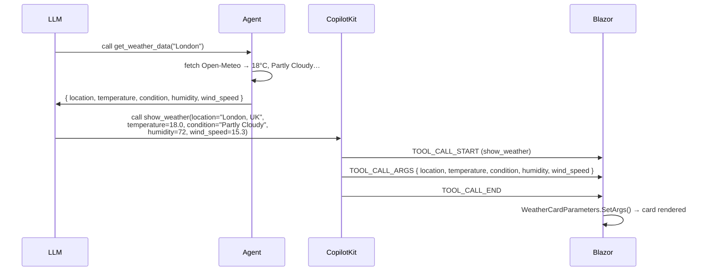

# Migrating the Python Agent from ag-ui-protocol to CopilotKit

This guide walks through migrating the demo agent (`agent/main.py`) from hand-rolled AG-UI event emission to CopilotKit's managed framework.  
**The Blazor C# frontend is untouched.** Every `.razor`, `.cs`, and `.csproj` file stays exactly as-is.

---

## What We Are Changing and Why

### The original approach

The current agent contains about 130 lines in `_ag_ui_stream()` that manually construct every AG-UI SSE event — `RUN_STARTED`, `TEXT_MESSAGE_START`, `TOOL_CALL_START`, `TOOL_CALL_ARGS`, `TOOL_CALL_END`, and `RUN_FINISHED`. This works, but it means the application code is responsible for protocol correctness. Any future change to the AG-UI spec requires touching this generator.

### What CopilotKit gives us

CopilotKit is a framework built on top of `ag-ui-protocol`. It wraps a LangGraph agent and handles all AG-UI event emission automatically. You register your graph once; CopilotKit streams the right events to the frontend without any manual wiring.

### The hard constraint

The Blazor frontend posts to `/api/agent/run` with a simple JSON body:

```json
{ "message": "What's the weather in Tokyo?", "thread_id": "abc-123" }
```

It reads back a plain SSE stream and calls `SetArgs()` on `WeatherCardParameters` or `FlightOptionsParameters`. Nothing in C# will change. The migration must be invisible to the frontend.

CopilotKit's managed endpoint (`/copilotkit_remote`) expects a richer `RunAgentInput` body.  
The solution is a thin **adapter endpoint** that keeps `/api/agent/run` alive, converts the Blazor format, and proxies internally to `/copilotkit_remote`.

---

## The Protocol Mismatch: Why You Need the Two-Tool Pattern

This is the most important concept in the migration. Read this section before touching any code.

### How the current agent works (deferred-args pattern)

```
LLM calls show_weather("London")
     ↓
on_tool_start  →  emit TOOL_CALL_START          (skeleton shown in Blazor)
     ↓
Tool executes  →  fetches Open-Meteo weather
     ↓
on_tool_end    →  emit TOOL_CALL_ARGS            ← contains FETCHED data
                  { location, temperature, condition, humidity, wind_speed }
     ↓
Blazor SetArgs() → WeatherCardParameters hydrated with real values
```

The key: `TOOL_CALL_ARGS` carries the tool's **return value** (the fetched data), not the LLM's input.

### How CopilotKit works

CopilotKit emits `TOOL_CALL_ARGS` with the LLM's **input arguments** — what the LLM supplied when it called the tool. It never reads the tool's return value for this purpose.

```
LLM calls show_weather("London")
     ↓
CopilotKit emits TOOL_CALL_ARGS  ← contains LLM INPUT: { "location": "London" }
```

If you keep the single-tool approach, `TOOL_CALL_ARGS` would contain only `{"location": "London"}`. Blazor's `WeatherCardParameters` would receive no `temperature`, `condition`, `humidity`, or `wind_speed`. The card would render empty.

### The fix: two-tool pattern

Split each UI tool into two tools:

| Tool | Role | Visible to Blazor? |
|---|---|---|
| `get_weather_data` | Fetches real data from Open-Meteo, returns JSON to the LLM | No |
| `show_weather` | LLM passes all display values as explicit parameters | Yes (UI tool) |
| `search_flights` | Fetches real offers from Amadeus, returns JSON to the LLM | No |
| `show_flight_options` | LLM passes full flight list as explicit parameters | Yes (UI tool) |

The flow with CopilotKit becomes:



Because the LLM has the fetched data in its context from the data tool, it can re-supply all values when calling the display tool. CopilotKit emits those as `TOOL_CALL_ARGS` and Blazor hydrates correctly.

---

## What Does Not Change

Before the changes, confirm what is frozen:

- Every C# file in `BlazorAGUIDemo/` and `AgUiProtocol/` — **untouched**
- `WeatherCardParameters` and `FlightOptionsParameters` — **untouched**
- `ComponentRegistry` registrations in `Program.cs` — **untouched**
- `AgentSchemaValidator` startup check — **untouched**
- `UI_TOOL_NAMES` frozenset and `ToolNames.all_ui_tools()` — **untouched**
- `/api/agent/schema` endpoint — **untouched**
- Tool name strings `"show_weather"` and `"show_flight_options"` — **untouched**

---

## Step-by-Step Migration

### Step 1 — Update `requirements.txt`

Replace `ag-ui-protocol` with `copilotkit`. CopilotKit lists `ag-ui-protocol` as a transitive dependency, so `from ag_ui.core import ...` continues to work anywhere it is needed.

**Before:**

```txt
fastapi>=0.136.1
uvicorn>=0.46.0
python-dotenv>=1.2.2
langchain>=1.2.18
langchain-anthropic>=1.4.3
langgraph>=1.1.10
httpx>=0.28.1
ag-ui-protocol>=0.1.18
```

**After:**

```txt
fastapi>=0.136.1
uvicorn>=0.46.0
python-dotenv>=1.2.2
langchain>=1.2.18
langchain-anthropic>=1.4.3
langgraph>=1.1.10
httpx>=0.28.1
copilotkit>=0.3.0
```

Install the new dependency:

```bash
pip install -r requirements.txt
```

---

### Step 2 — Update `tool_names.py`

Add constants for the two new data tools. They use a naming convention that distinguishes them from UI tools. Critically, they are **not** included in `all_ui_tools()`, so the Blazor `ComponentRegistry` never sees them and `AgentSchemaValidator` does not expect them.

```python
"""
Single source of truth for AG-UI tool name strings on the Python side.

UI tools  — registered in the Blazor ComponentRegistry; CopilotKit emits
            TOOL_CALL_START / TOOL_CALL_ARGS / TOOL_CALL_END for these.

Data tools — internal only; they fetch real data and return it to the LLM
             as context.  They are never registered in Blazor.
"""


class ToolNames:
    # ------------------------------------------------------------------
    # UI tools — must match Blazor ComponentRegistry exactly
    # ------------------------------------------------------------------
    SHOW_WEATHER        = "show_weather"
    SHOW_FLIGHT_OPTIONS = "show_flight_options"

    # ------------------------------------------------------------------
    # Data tools — internal; invisible to Blazor
    # ------------------------------------------------------------------
    GET_WEATHER_DATA = "get_weather_data"
    SEARCH_FLIGHTS   = "search_flights"

    @classmethod
    def all_ui_tools(cls) -> frozenset[str]:
        """Only UI tools.  Data tools are deliberately excluded."""
        return frozenset({cls.SHOW_WEATHER, cls.SHOW_FLIGHT_OPTIONS})
```

---

### Step 3 — Rewrite `main.py`

Below is the complete replacement for `main.py`. Walk through each section to understand the changes.

```python
"""
AG-UI demo agent — FastAPI + LangGraph + Anthropic Claude + CopilotKit

CopilotKit manages all AG-UI SSE event emission automatically.
The two-tool pattern (data tool + display tool) ensures that
TOOL_CALL_ARGS carries the complete display payload that
WeatherCardParameters and FlightOptionsParameters expect.

Usage:
    pip install -r requirements.txt
    ANTHROPIC_API_KEY=sk-ant-... uvicorn main:app --reload --port 8000
"""

from __future__ import annotations

import json
import os
import re
import time
import uuid
from typing import Any, AsyncGenerator

import httpx
from copilotkit import CopilotKitRemoteEndpoint, LangGraphAgent
from copilotkit.integrations.fastapi import add_fastapi_endpoint
from dotenv import load_dotenv
from fastapi import FastAPI
from fastapi.middleware.cors import CORSMiddleware
from fastapi.responses import StreamingResponse
from langchain_anthropic import ChatAnthropic
from langchain_core.tools import tool
from langgraph.prebuilt import create_react_agent
from pydantic import BaseModel
from tool_names import ToolNames

load_dotenv()

# ---------------------------------------------------------------------------
# FastAPI setup
# ---------------------------------------------------------------------------

app = FastAPI(title="AG-UI Demo Agent")

app.add_middleware(
    CORSMiddleware,
    allow_origins=[
        "http://localhost:5000",
        "http://localhost:5001",
        "http://localhost:5002",
        "https://localhost:7001",
        "https://localhost:7002",
        "http://localhost:*",
    ],
    allow_methods=["POST", "GET", "OPTIONS"],
    allow_headers=["*"],
)

# ---------------------------------------------------------------------------
# AG-UI tool names that route to the Blazor frontend (not back to the LLM)
# ---------------------------------------------------------------------------

UI_TOOL_NAMES: frozenset[str] = ToolNames.all_ui_tools()

# ---------------------------------------------------------------------------
# Open-Meteo weather fetch (no API key required)
# ---------------------------------------------------------------------------

_WMO_CONDITIONS: list[tuple[int | range, str]] = [
    (0,              "Sunny"),
    (1,              "Sunny"),
    (2,              "Partly Cloudy"),
    (3,              "Cloudy"),
    (range(45, 50),  "Cloudy"),       # fog
    (range(51, 68),  "Rainy"),        # drizzle / rain / freezing rain
    (range(71, 78),  "Snowy"),        # snow / snow grains
    (range(80, 83),  "Rainy"),        # rain showers
    (range(85, 87),  "Snowy"),        # snow showers
    (range(95, 100), "Stormy"),       # thunderstorms
]


def _wmo_to_condition(code: int) -> str:
    for entry, label in _WMO_CONDITIONS:
        if isinstance(entry, range) and code in entry:
            return label
        if isinstance(entry, int) and code == entry:
            return label
    return "Cloudy"


def _fetch_weather(location: str) -> dict:
    """
    Geocode *location* then fetch current conditions from Open-Meteo.
    Returns a dict matching WeatherCardParameters field names.
    """
    geo = httpx.get(
        "https://geocoding-api.open-meteo.com/v1/search",
        params={"name": location, "count": 1, "language": "en", "format": "json"},
        timeout=10.0,
    )
    geo.raise_for_status()
    results = geo.json().get("results")
    if not results:
        raise ValueError(f"Location not found: {location!r}")

    hit     = results[0]
    lat     = hit["latitude"]
    lon     = hit["longitude"]
    display = hit.get("name", location)
    country = hit.get("country", "")
    if country:
        display = f"{display}, {country}"

    wx = httpx.get(
        "https://api.open-meteo.com/v1/forecast",
        params={
            "latitude":  lat,
            "longitude": lon,
            "current":   "temperature_2m,relative_humidity_2m,wind_speed_10m,weather_code",
            "wind_speed_unit": "kmh",
        },
        timeout=10.0,
    )
    wx.raise_for_status()
    current = wx.json()["current"]

    return {
        "location":    display,
        "temperature": current["temperature_2m"],
        "condition":   _wmo_to_condition(current["weather_code"]),
        "humidity":    current["relative_humidity_2m"],
        "wind_speed":  current["wind_speed_10m"],
    }


# ---------------------------------------------------------------------------
# Amadeus flight search (sandbox — free, no billing required)
# ---------------------------------------------------------------------------

_AMADEUS_BASE = "https://test.api.amadeus.com"

_amadeus_token: dict = {"value": "", "expires_at": 0.0}


def _amadeus_access_token() -> str:
    if time.time() < _amadeus_token["expires_at"] - 30:
        return _amadeus_token["value"]

    client_id     = os.getenv("AMADEUS_CLIENT_ID", "")
    client_secret = os.getenv("AMADEUS_CLIENT_SECRET", "")
    if not client_id or not client_secret:
        raise ValueError(
            "AMADEUS_CLIENT_ID and AMADEUS_CLIENT_SECRET must be set in .env. "
            "Register free at https://developers.amadeus.com"
        )

    resp = httpx.post(
        f"{_AMADEUS_BASE}/v1/security/oauth2/token",
        data={
            "grant_type":    "client_credentials",
            "client_id":     client_id,
            "client_secret": client_secret,
        },
        timeout=10.0,
    )
    resp.raise_for_status()
    body = resp.json()
    _amadeus_token["value"]      = body["access_token"]
    _amadeus_token["expires_at"] = time.time() + body.get("expires_in", 1799)
    return _amadeus_token["value"]


def _parse_duration(iso: str) -> str:
    h  = int(m.group(1)) if (m := re.search(r"(\d+)H", iso)) else 0
    mn = int(m.group(1)) if (m := re.search(r"(\d+)M", iso)) else 0
    return f"{h}h {mn}m" if mn else f"{h}h"


def _mock_flights(origin: str, destination: str, date: str) -> dict:
    import hashlib

    seed     = int(hashlib.md5(f"{origin}{destination}{date}".encode()).hexdigest()[:8], 16)
    pool     = [
        ("British Airways",    "BA"),
        ("Lufthansa",          "LH"),
        ("Air France",         "AF"),
        ("Emirates",           "EK"),
        ("Singapore Airlines", "SQ"),
        ("Qatar Airways",      "QR"),
        ("KLM",                "KL"),
        ("United Airlines",    "UA"),
    ]
    route_len = abs(hash(f"{origin}{destination}")) % 10 + 2

    flights = []
    for i in range(4):
        airline, code = pool[(seed + i * 7) % len(pool)]
        number        = f"{code}{((seed + i * 13) % 900) + 100}"
        dep_h         = (6 + i * 4 + seed % 3) % 24
        dep_m         = (seed * (i + 1)) % 60
        dur_h         = route_len + (i % 2)
        dur_m         = (seed * (i + 3)) % 60
        arr_h         = (dep_h + dur_h + (dep_m + dur_m) // 60) % 24
        arr_m         = (dep_m + dur_m) % 60
        price         = round(120 + (seed % 400) + i * 45 + route_len * 30, 2)

        flights.append({
            "airline":        airline,
            "flight_number":  number,
            "departure_time": f"{dep_h:02d}:{dep_m:02d}",
            "arrival_time":   f"{arr_h:02d}:{arr_m:02d}",
            "price_gbp":      price,
            "duration":       f"{dur_h}h {dur_m}m" if dur_m else f"{dur_h}h",
        })

    return {
        "origin":      origin.upper(),
        "destination": destination.upper(),
        "date":        date,
        "flights":     flights,
    }


def _fetch_flights(origin: str, destination: str, date: str) -> dict:
    if not os.getenv("AMADEUS_CLIENT_ID", "").strip() or \
       os.getenv("AMADEUS_CLIENT_ID", "") == "your_client_id_here":
        return _mock_flights(origin, destination, date)

    token = _amadeus_access_token()
    resp  = httpx.get(
        f"{_AMADEUS_BASE}/v2/shopping/flight-offers",
        params={
            "originLocationCode":      origin.upper(),
            "destinationLocationCode": destination.upper(),
            "departureDate":           date,
            "adults":                  1,
            "max":                     4,
            "currencyCode":            "GBP",
        },
        headers={"Authorization": f"Bearer {token}"},
        timeout=15.0,
    )
    resp.raise_for_status()
    body     = resp.json()
    carriers = body.get("dictionaries", {}).get("carriers", {})
    flights  = []

    for offer in body.get("data", []):
        itin         = offer["itineraries"][0]
        segments     = itin["segments"]
        first        = segments[0]
        last         = segments[-1]
        carrier_code = first["carrierCode"]
        flights.append({
            "airline":        carriers.get(carrier_code, carrier_code),
            "flight_number":  f"{carrier_code}{first['number']}",
            "departure_time": first["departure"]["at"][11:16],
            "arrival_time":   last["arrival"]["at"][11:16],
            "price_gbp":      float(offer["price"]["total"]),
            "duration":       _parse_duration(itin["duration"]),
        })

    return {
        "origin":      origin.upper(),
        "destination": destination.upper(),
        "date":        date,
        "flights":     flights,
    }


# ---------------------------------------------------------------------------
# Tool definitions — two-tool pattern
#
# Each UI capability is split into:
#   1. A data tool  — fetches real data; returns JSON to the LLM context.
#   2. A display tool — LLM re-supplies all values as explicit parameters;
#                       CopilotKit emits those as TOOL_CALL_ARGS;
#                       Blazor hydrates WeatherCardParameters /
#                       FlightOptionsParameters from those args.
# ---------------------------------------------------------------------------


# --- Weather: data tool ---------------------------------------------------

@tool(ToolNames.GET_WEATHER_DATA)
def get_weather_data(location: str) -> str:
    """Fetch current weather conditions for a city or location.

    Returns JSON containing:
      location    — the resolved display name (e.g. "London, United Kingdom")
      temperature — current temperature in °C
      condition   — one of: Sunny, Partly Cloudy, Cloudy, Rainy, Snowy, Stormy
      humidity    — relative humidity as an integer percentage
      wind_speed  — wind speed in km/h

    Call this tool BEFORE calling show_weather.  Do not invent weather values.
    """
    try:
        return json.dumps(_fetch_weather(location))
    except ValueError as exc:
        return f"Error: {exc}"
    except httpx.HTTPError as exc:
        return f"Weather service error: {exc}"


# --- Weather: display tool ------------------------------------------------

@tool(ToolNames.SHOW_WEATHER)
def show_weather(
    location:    str,
    temperature: float,
    condition:   str,
    humidity:    int,
    wind_speed:  float,
) -> str:
    """Display a weather card with the provided values.

    IMPORTANT: Call get_weather_data first to obtain real values, then pass
    ALL fields from its response to this tool unchanged.  Do not invent or
    modify temperature, condition, humidity, or wind_speed.

    location    — resolved display name from get_weather_data
    temperature — °C value from get_weather_data
    condition   — condition string from get_weather_data
    humidity    — integer percentage from get_weather_data
    wind_speed  — km/h value from get_weather_data
    """
    return "Weather card displayed."


# --- Flights: data tool ---------------------------------------------------

@tool(ToolNames.SEARCH_FLIGHTS)
def search_flights(origin: str, destination: str, date: str) -> str:
    """Search for available flight options between two airports.

    origin      — IATA airport code (e.g. LHR for London Heathrow)
    destination — IATA airport code (e.g. JFK for New York JFK)
    date        — departure date in YYYY-MM-DD format

    Returns JSON containing origin, destination, date, and a flights array.
    Each flight has: airline, flight_number, departure_time,
    arrival_time, price_gbp, duration.

    Call this tool BEFORE calling show_flight_options.
    """
    try:
        return json.dumps(_fetch_flights(origin, destination, date))
    except ValueError as exc:
        return f"Error: {exc}"
    except httpx.HTTPError as exc:
        return f"Flight service error: {exc}"


# --- Flights: display tool -----------------------------------------------

@tool(ToolNames.SHOW_FLIGHT_OPTIONS)
def show_flight_options(
    origin:      str,
    destination: str,
    date:        str,
    flights:     list[dict[str, Any]],
) -> str:
    """Display a flight options panel with the provided data.

    IMPORTANT: Call search_flights first, then pass its ENTIRE response to
    this tool.  Do not modify, filter, or invent flight details.

    origin, destination, date — pass through from search_flights unchanged
    flights — the complete flights array from search_flights; each element
              must have: airline, flight_number, departure_time,
              arrival_time, price_gbp, duration
    """
    return "Flight options displayed."


# ---------------------------------------------------------------------------
# Assertions — fail at module load on any name mismatch
# ---------------------------------------------------------------------------

assert get_weather_data.name == ToolNames.GET_WEATHER_DATA, (
    f"Tool name mismatch: function='{get_weather_data.name}' "
    f"constant='{ToolNames.GET_WEATHER_DATA}'"
)
assert show_weather.name == ToolNames.SHOW_WEATHER, (
    f"Tool name mismatch: function='{show_weather.name}' "
    f"constant='{ToolNames.SHOW_WEATHER}'"
)
assert search_flights.name == ToolNames.SEARCH_FLIGHTS, (
    f"Tool name mismatch: function='{search_flights.name}' "
    f"constant='{ToolNames.SEARCH_FLIGHTS}'"
)
assert show_flight_options.name == ToolNames.SHOW_FLIGHT_OPTIONS, (
    f"Tool name mismatch: function='{show_flight_options.name}' "
    f"constant='{ToolNames.SHOW_FLIGHT_OPTIONS}'"
)

# ---------------------------------------------------------------------------
# System prompt
# ---------------------------------------------------------------------------

_SYSTEM_PROMPT = """You are a helpful travel assistant.

When the user asks about weather, follow these steps in order:
  1. Call get_weather_data with the city or location name.
  2. Read the JSON it returns carefully.
  3. Call show_weather and pass ALL fields from get_weather_data exactly:
       location    → the display name returned (e.g. "London, United Kingdom")
       temperature → the temperature_2m value
       condition   → the condition string (e.g. "Partly Cloudy")
       humidity    → the humidity integer
       wind_speed  → the wind_speed value
  Never invent or estimate weather values.

When the user asks about flights, follow these steps in order:
  1. Call search_flights with:
       origin      → IATA code (e.g. LHR, JFK, NRT, SYD)
       destination → IATA code
       date        → YYYY-MM-DD (use today or next convenient date if unspecified)
  2. Read the JSON it returns carefully.
  3. Call show_flight_options and pass ALL fields exactly as returned:
       origin, destination, date → unchanged
       flights → the complete flights array, every element intact
  Never modify, filter, or invent flight details.

After calling a UI tool (show_weather or show_flight_options), follow up with
one short sentence confirming what you displayed.
Keep all non-tool responses brief and conversational.
"""

# ---------------------------------------------------------------------------
# LangGraph agent
# ---------------------------------------------------------------------------

llm = ChatAnthropic(
    model=os.getenv("ANTHROPIC_MODEL", "claude-haiku-4-5-20251001"),
    streaming=True,
)

agent = create_react_agent(
    llm,
    tools=[get_weather_data, show_weather, search_flights, show_flight_options],
    prompt=_SYSTEM_PROMPT,
)

# ---------------------------------------------------------------------------
# CopilotKit setup
# ---------------------------------------------------------------------------

sdk = CopilotKitRemoteEndpoint(
    agents=[
        LangGraphAgent(
            name="travel_agent",
            description=(
                "A travel assistant that shows real-time weather cards "
                "and flight option panels."
            ),
            graph=agent,
        )
    ]
)

# Registers POST /copilotkit_remote — CopilotKit handles all AG-UI
# event emission from here.  The Blazor frontend does not call this
# endpoint directly; it uses /api/agent/run below.
add_fastapi_endpoint(app, sdk, "/copilotkit_remote")

# ---------------------------------------------------------------------------
# Blazor compatibility adapter
#
# The C# AgUiStreamService posts:
#   POST /api/agent/run
#   { "message": "...", "thread_id": "..." }
#
# CopilotKit's /copilotkit_remote expects RunAgentInput — a richer format
# with threadId, runId, agentName, and a messages array.
#
# This adapter converts the Blazor format, proxies to /copilotkit_remote
# running on the same server, and streams the SSE response back unchanged.
# The C# side has no knowledge of this translation layer.
# ---------------------------------------------------------------------------

_AGENT_PORT = int(os.getenv("PORT", "8000"))


class RunRequest(BaseModel):
    message:   str
    thread_id: str = ""


@app.post("/api/agent/run")
async def run_agent(body: RunRequest) -> StreamingResponse:
    """Convert the Blazor request format and proxy to /copilotkit_remote."""

    payload = {
        "threadId":  body.thread_id or str(uuid.uuid4()),
        "runId":     str(uuid.uuid4()),
        "agentName": "travel_agent",
        "messages": [
            {
                "id":      str(uuid.uuid4()),
                "role":    "user",
                "content": body.message,
            }
        ],
        "state":   {},
        "actions": [],
        "context": [],
    }

    async def _proxy() -> AsyncGenerator[bytes, None]:
        async with httpx.AsyncClient(
            base_url=f"http://127.0.0.1:{_AGENT_PORT}",
            timeout=httpx.Timeout(300.0),
        ) as client:
            async with client.stream(
                "POST",
                "/copilotkit_remote",
                json=payload,
                headers={"Content-Type": "application/json"},
            ) as response:
                async for chunk in response.aiter_bytes():
                    yield chunk

    return StreamingResponse(
        _proxy(),
        media_type="text/event-stream",
        headers={
            "Cache-Control":    "no-cache",
            "X-Accel-Buffering": "no",
            "Connection":       "keep-alive",
        },
    )


@app.get("/health")
async def health() -> dict:
    return {"status": "ok"}


@app.get("/api/agent/schema")
async def schema() -> dict:
    """Expose the list of UI tool names so the Blazor frontend can validate
    its ComponentRegistry at startup.  Only UI tools are listed here —
    data tools are internal and invisible to Blazor."""
    return {"ui_tools": sorted(UI_TOOL_NAMES)}
```

---

## What Changed, Line by Line

### Imports

| Removed | Added |
|---|---|
| `from ag_ui.core import EventType, RunErrorEvent, ...` | `from copilotkit import CopilotKitRemoteEndpoint, LangGraphAgent` |
| `from ag_ui.encoder import EventEncoder` | `from copilotkit.integrations.fastapi import add_fastapi_endpoint` |
| `_encoder = EventEncoder()` | *(gone)* |

CopilotKit owns the encoder and all event classes internally. You never touch them again.

### Tool count: 2 → 4

| Old tool | New tools |
|---|---|
| `show_weather(location)` | `get_weather_data(location)` + `show_weather(location, temperature, condition, humidity, wind_speed)` |
| `show_flight_options(origin, destination, date)` | `search_flights(origin, destination, date)` + `show_flight_options(origin, destination, date, flights)` |

The fetch logic (`_fetch_weather`, `_fetch_flights`) moved from the tool body into the data tools. The display tools contain only a one-line return statement — their only job is to declare the parameter signature that CopilotKit will emit as `TOOL_CALL_ARGS`.

### Assertions: 2 → 4

One assertion per tool. The pattern is the same as before:

```python
assert show_weather.name == ToolNames.SHOW_WEATHER, (...)
```

### `_DEFERRED_ARG_TOOLS` removed

The deferred-args pattern was the only reason `_DEFERRED_ARG_TOOLS` existed. With CopilotKit, every display tool's args are emitted immediately as the LLM inputs — no deferral needed. The variable and all the `if tool_name in _DEFERRED_ARG_TOOLS:` logic is gone.

### `_ag_ui_stream` removed

The entire 130-line async generator is gone. CopilotKit replaces it completely.

### New: CopilotKit agent registration

```python
sdk = CopilotKitRemoteEndpoint(
    agents=[
        LangGraphAgent(
            name="travel_agent",
            description="...",
            graph=agent,           # the compiled LangGraph graph
        )
    ]
)
add_fastapi_endpoint(app, sdk, "/copilotkit_remote")
```

Note the parameter name: `graph=`, not `agent=`. Pass the compiled graph returned by `create_react_agent`.

### New: adapter endpoint

```python
@app.post("/api/agent/run")
async def run_agent(body: RunRequest) -> StreamingResponse:
    payload = {
        "threadId":  body.thread_id or str(uuid.uuid4()),
        "runId":     str(uuid.uuid4()),
        "agentName": "travel_agent",
        "messages":  [{"id": ..., "role": "user", "content": body.message}],
        ...
    }
    # proxy to /copilotkit_remote, stream bytes back unchanged
```

The `agentName` value must match the `name` you supplied to `LangGraphAgent(name="travel_agent", ...)`.

---

## Why the Adapter Works

The Blazor `AgUiStreamService` opens an HTTP connection to `/api/agent/run` and reads the response byte-by-byte as a stream. It has no concept of what is behind that endpoint.

The adapter starts an outbound connection to `/copilotkit_remote` on the same server. CopilotKit writes AG-UI SSE events to that connection. The adapter reads those bytes and writes them into the Blazor response stream without modification.

```
Blazor                   Python (same process)
------                   ----------------------
POST /api/agent/run  →   run_agent()
                              ↓
                         build RunAgentInput payload
                              ↓
                         POST /copilotkit_remote  (httpx, same server)
                              ↓
                         CopilotKit handles LangGraph, emits AG-UI events
                              ↓
                         bytes streamed back through run_agent()
                              ↓
SSE stream        ←      StreamingResponse
```

The C# `AgUiStreamService` reads `RUN_STARTED`, `TEXT_MESSAGE_*`, `TOOL_CALL_*`, `RUN_FINISHED` — exactly the same event types as before. The protocol is identical. Only the Python side changed.

---

## Verifying the Migration

### 1. Start the agent

```bash
cd agent
uvicorn main:app --reload --port 8000
```

You should see uvicorn start without any assertion errors. Both endpoints are registered:

```
INFO:     Application startup complete.
INFO:     Uvicorn running on http://127.0.0.1:8000
```

### 2. Verify the schema endpoint is unchanged

```bash
curl http://localhost:8000/api/agent/schema
```

Expected response — identical to before the migration:

```json
{ "ui_tools": ["show_flight_options", "show_weather"] }
```

Data tools (`get_weather_data`, `search_flights`) must NOT appear here. If they do, you accidentally added them to `all_ui_tools()` in `tool_names.py`.

### 3. Start the Blazor app

```bash
cd BlazorAGUIDemo
dotnet run
```

The `AgentSchemaValidator` startup check will request `/api/agent/schema` and verify that `show_weather` and `show_flight_options` are present. A clean start confirms the contract is intact:

```
info: AgentSchemaValidator[0]
      AG-UI tool name validation passed — all 2 registered tools found in agent schema.
```

### 4. Test weather

In the chat UI, send: `What's the weather in Tokyo right now?`

Expected behavior:
- Skeleton card appears (from `TOOL_CALL_START`)
- Card fills in with real temperature, condition, and humidity (from `TOOL_CALL_ARGS`)
- Agent sends a short confirmation sentence

### 5. Test flights

Send: `Show me flights from LHR to JFK next Friday`

Expected behavior:
- Skeleton flight panel appears
- Panel fills with four flight rows
- Agent confirms the display

### 6. Check browser DevTools

Open the Network tab and inspect the SSE stream from `/api/agent/run`. You should see events in this sequence for a weather request:

```
data: {"type":"RUN_STARTED","runId":"...","threadId":"..."}
data: {"type":"TOOL_CALL_START","toolCallId":"...","toolCallName":"show_weather"}
data: {"type":"TOOL_CALL_ARGS","toolCallId":"...","delta":"{\"location\":\"Tokyo, Japan\",\"temperature\":22.4,\"condition\":\"Sunny\",\"humidity\":65,\"wind_speed\":12.0}"}
data: {"type":"TOOL_CALL_END","toolCallId":"..."}
data: {"type":"TEXT_MESSAGE_START","messageId":"...","role":"assistant"}
data: {"type":"TEXT_MESSAGE_CONTENT","messageId":"...","delta":"Here is the current weather for Tokyo."}
data: {"type":"TEXT_MESSAGE_END","messageId":"..."}
data: {"type":"RUN_FINISHED","runId":"...","threadId":"..."}
```

The `TOOL_CALL_ARGS` event carries all five `WeatherCardParameters` fields. This is what was previously emitted in the `on_tool_end` handler — now CopilotKit emits it automatically from the LLM's input to `show_weather`.

---

## Common Problems

### The weather card shows empty or default values

**Cause:** The LLM called `show_weather` without calling `get_weather_data` first, and guessed the parameter values.

**Fix:** The system prompt must be explicit. Check the ordering instructions under the weather section. If the problem persists with a smaller model (e.g. Haiku), switch to `claude-sonnet-4-5` for better instruction following.

### `AssertionError: Tool name mismatch`

**Cause:** A `@tool` decorator's first argument does not match the corresponding `ToolNames` constant.

**Fix:** Compare `tool.name` with the constant. The assertion message shows both values.

### `AgentSchemaValidator` fails at Blazor startup

**Cause:** `get_weather_data` or `search_flights` appeared in the schema response, meaning they were accidentally added to `all_ui_tools()`.

**Fix:** Verify `ToolNames.all_ui_tools()` returns only `{SHOW_WEATHER, SHOW_FLIGHT_OPTIONS}`.

### `Connection refused` from the adapter

**Cause:** The agent is not running on the expected port, or `_AGENT_PORT` is set incorrectly.

**Fix:** Check the `PORT` environment variable or the uvicorn startup command. The adapter uses `http://127.0.0.1:{_AGENT_PORT}/copilotkit_remote`. Both `/api/agent/run` and `/copilotkit_remote` live on the same server, so the proxy is always a loopback connection.

### `agentName` mismatch

**Cause:** The `agentName` field in the adapter's payload (`"travel_agent"`) does not match the `name` argument in `LangGraphAgent(name="travel_agent", ...)`.

**Fix:** Both values must be identical strings. A mismatch causes CopilotKit to return a 404 or ignore the request silently.

---

## Summary of Changes

| File | Change |
|---|---|
| `requirements.txt` | `ag-ui-protocol` → `copilotkit` |
| `tool_names.py` | Added `GET_WEATHER_DATA` and `SEARCH_FLIGHTS` constants |
| `main.py` — imports | Replaced `ag_ui.*` with `copilotkit.*` |
| `main.py` — tools | 2 tools → 4 tools (two-tool pattern) |
| `main.py` — assertions | 2 assertions → 4 assertions |
| `main.py` — agent | Same `create_react_agent` call, 4 tools now |
| `main.py` — CopilotKit | Added `sdk`, `LangGraphAgent`, `add_fastapi_endpoint` |
| `main.py` — adapter | New `/api/agent/run` proxies to `/copilotkit_remote` |
| `main.py` — removed | `_encoder`, `_DEFERRED_ARG_TOOLS`, `_ag_ui_stream` generator |
| **All C# files** | **No changes** |
